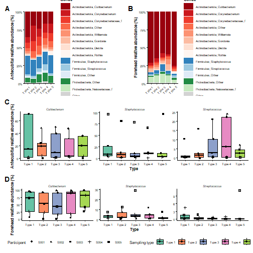
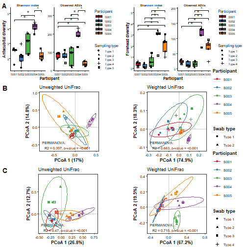
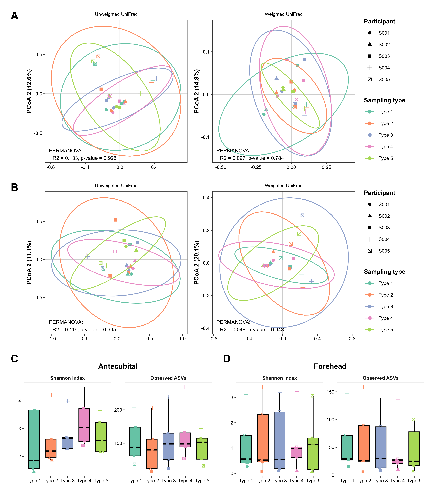
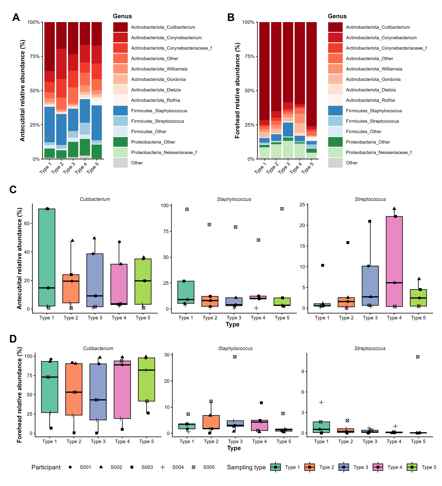
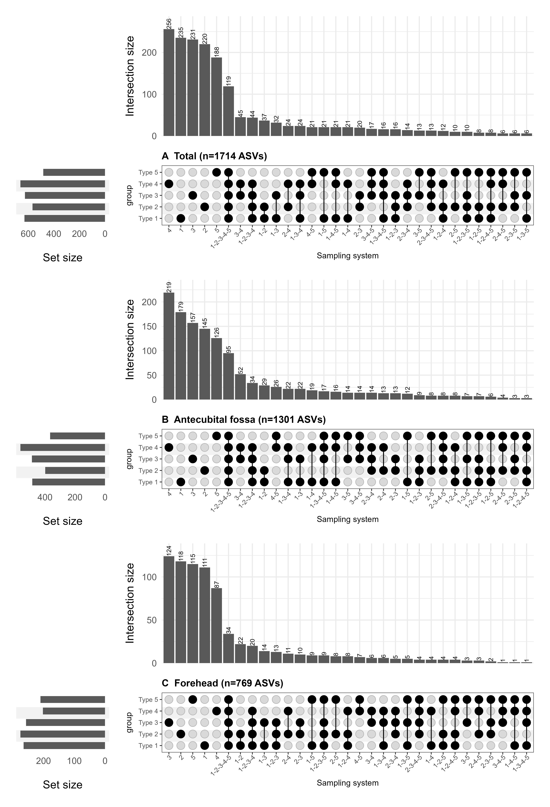
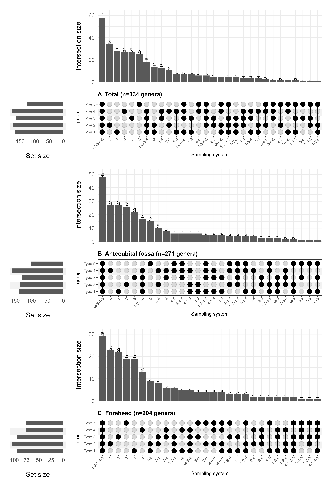
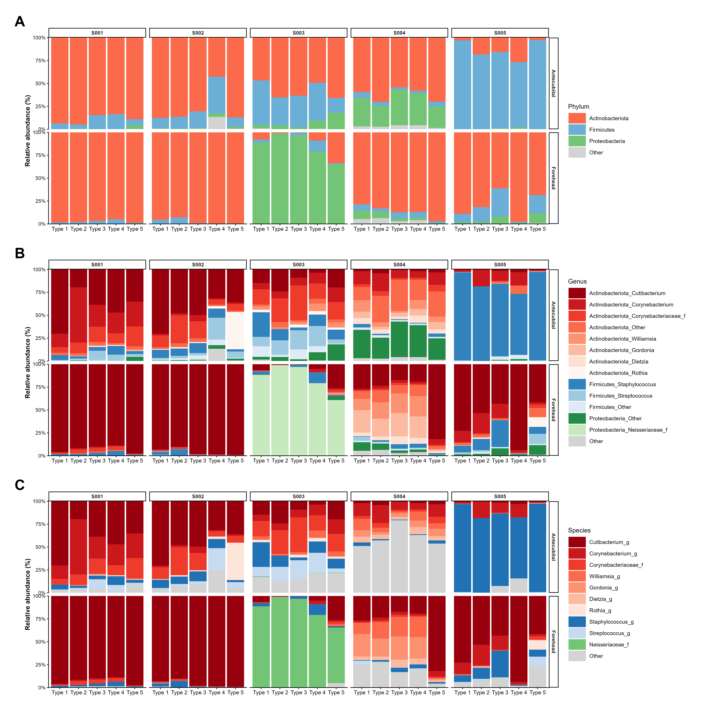
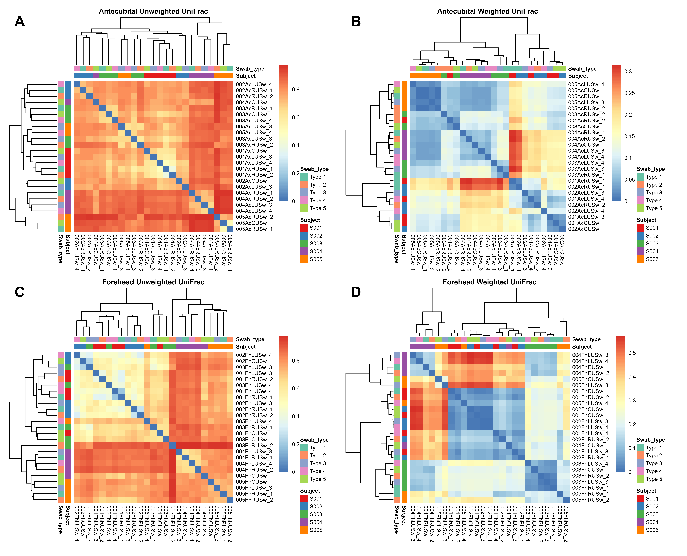
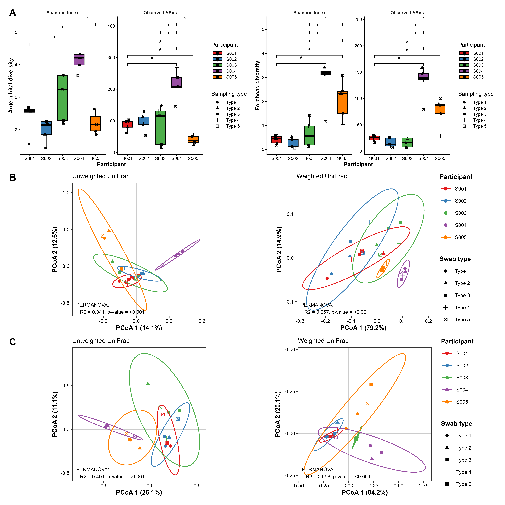

이 문서는 **decontam 완료 후 저장된 phyloseq 객체**
`./Phyloseq/phy_F270R240_260812_v4.rds`를 불러오는 단계부터 시작합니다.
원자료 import, ASV table 구성 및 decontam 과정은 포함하지 않습니다. 저장된 객체에서
control sample을 제외하고 rarefaction한 뒤, 통계 분석과 각 패널 생성 및 최종 Figure
저장까지 수행합니다.

# Packages and plotting helper functions


``` r
suppressPackageStartupMessages({
  library(phyloseq)
  library(vegan)
  library(dplyr)
  library(tidyr)
  library(tibble)
  library(ggplot2)
  library(patchwork)
  library(ComplexUpset)
  library(pheatmap)
  library(RColorBrewer)
  library(ggpubr)
})


# Helper functions for manuscript figure and table generation


#### 1. General plotting theme ####
.shared_theme <- function() {
  list(
    theme_classic(),
    theme(
      text                  = element_text(size = 10),
      axis.text.x           = element_text(angle = 45, hjust = 1),
      legend.title          = element_blank(),
      legend.margin         = margin(6, 6, 6, 6),
      legend.background     = element_rect(fill = NA, color = NA),
      strip.background      = element_blank(),
      panel.background = element_rect(fill = "transparent", color = NA),
      plot.background  = element_rect(fill = "transparent", color = NA),
      legend.position       = "none"
    )
  )
}

#### 2. Alpha diversity plotting ####
alpha_plot <- function(
    table,
    x_,
    y_ = "Shannon",
    colx_ = x_,
    shape = shape,
    ylim = 7,
    y_kruskal = 6.5,
    col = c("#E31A1C", "#1F78B4", "#4D4D4D")
) {
  
  comp_ <- as.vector(unique(table[, x_]))
  Num   <- length(comp_)
  
  base_plot <- ggplot(table, aes(x = .data[[x_]], y = .data[[y_]])) +

    geom_boxplot(# aes(color = .data[[x_]]),
                 show.legend = FALSE, 
                 outliers = FALSE# width = 0.2
                 ) +
    geom_jitter(aes(color = .data[[colx_]]# , shape = .data[[shape]]
                    ),
                width = 0.15,  size = 2) +
    scale_y_continuous(limits = c(0, ylim)) +
    scale_fill_manual(values = col) +
    scale_color_manual(values = col) +
    ylab(y_) +
    theme_classic() + 
    .shared_theme()
  

  
  return(base_plot)
}


#### 3. Beta diversity plotting and statistics ####
beta_plot <- function(phyloseq, type, shap = NULL, seed = 42, plot = "PCoA",
                      SampleID = "SampleID", type_col, col_inout       = c("out"), col_right_left  = c("right"), indices = c("bray", "jaccard", "unifrac", "wunifrac")) {
  # Round p-values
  value <- function(val) {
    if (val > 0.001)
      round(val, 3)
    else
      "<0.001"
  }
  
  out_name <- function(v1)
    deparse(substitute(v1))
  
  plots       <- list()
  result_list <- list()
  
  for (index in indices) {
    set.seed(seed)
    x.dist <- phyloseq::distance(phyloseq, method = index)
    dist   <- out_name(x.dist)
    meta   <- phyloseq %>% sample_data() %>% data.frame()
    
    # PERMANOVA
    set.seed(seed)
    Perm    <- adonis2(
      as.formula(glue("{dist} ~ {type}")),
      data         = data.frame(sample_data(phyloseq)),
      permutations = 9999,
      method = index,
      strata = meta$SubjectID
    ) 
    Perm.p  <- value(Perm$`Pr(>F)`[1])
    Perm.R2 <- round(Perm$R2[1], 3)
    
    result <- data.frame(
      Statistical.test = "PERMANOVA",
      DF               = Perm$Df[1],
      Sum.Sq           = Perm$SumOfSqs[1],
      Mean.Sq          = NA,
      F.Statist        = Perm$F[1],
      R.Squared        = Perm.R2,
      P.value          = Perm$`Pr(>F)`[1]
    )
    result_list[[index]] <- result
    
    # Ordinate
    set.seed(seed)
    ord    <- ordinate(phyloseq, plot, index)
    pcoa_df <- data.frame(meta, ord$vectors[, 1:2])
    PC1 <- round(ord$values["Relative_eig"][1, ] * 100, 1)
    PC2 <- round(ord$values["Relative_eig"][2, ] * 100, 1)
    
    Title <- switch(
      index,
      bray     = "Bray-curtis",
      jaccard  = "Jaccard",
      unifrac  = "Unweighted UniFrac",
      wunifrac = "Weighted UniFrac"
    )
    
    main.plot <- pcoa_df %>%
      ggplot(aes(x = Axis.1, y = Axis.2)) +
      geom_vline(xintercept = 0, colour = "grey80") +
      geom_hline(yintercept = 0, colour = "grey80") +
      geom_point(aes_string(shape = shap, color = type),
                 alpha = 0.5,
                 size = 2) +
      stat_ellipse(aes_string(color = type)) +
      scale_color_manual(values = type_col) +
      labs(x = paste0("PCoA1 (", PC1, "%)"),
           y = paste0("PCoA2 (", PC2, "%)")) +
      annotate(
        "text",
        hjust = 0,
        vjust = -0.2,
        x = -Inf,
        y = -Inf,
        size = 3,
        # size 10pt ??3 in ggplot units
        label = paste0(
          # Title,
          "\n PERMANOVA: ",
          "\n R2 = ",
          Perm.R2,
          ", p-value = ", Perm.p ) ) +
      .shared_theme() +
      theme(
        legend.position = "right",
        # beta plot?€ legend ?쒖떆
        plot.caption    = element_markdown(),
        aspect.ratio    = 1,
        legend.background = element_rect(fill = scales::alpha("white", 0.5)),
        legend.key = element_rect(fill = "transparent")
      )
    
    # Legend position inside plot (optional)
    if (col_inout == "in" && col_right_left == "right") {
      main.plot <- main.plot + theme(
        legend.position      = c(1, 1),
        legend.justification = c("right", "top"),
        legend.box.just      = "right"
      )
    } else if (col_inout == "in" && col_right_left == "left") {
      main.plot <- main.plot + theme(
        legend.position      = c(0, 1),
        legend.justification = c("left", "top"),
        legend.box.just      = "left"
      )
    }
    
    assign(paste0(index, "_p"), main.plot)
    plots[[index]] <- main.plot
  }
  
  plot_list     <- lapply(indices, function(index)
    get(paste0(index, "_p")))
  plots[["Total"]] <- ggarrange(plotlist = plot_list,
                                ncol = 2,
                                nrow = 2)
  
  return(list(plots = plots, results = result_list))
}


run_beta_stats <- function(physeq, index = "bray", group_var = "Site2", seed = 42) {
  set.seed(seed)
  dist_obj <- phyloseq::distance(physeq, method = index)
  meta <- as(sample_data(physeq), "data.frame")
  
  # PERMANOVA
  permanova <- adonis2(as.formula(paste("dist_obj ~", group_var)),
                       data = meta, permutations = 9999, 
                       method = index, 
                       strata = meta[["SubjectID"]]) ############
  p_perm <- format_pval(permanova$`Pr(>F)`[1])
  r2_perm <- round(permanova$R2[1], 3)
  
  list(
    dist = dist_obj,
    permanova = list(p = p_perm, R2 = r2_perm)
    
  )
}

format_pval <- function(val) {
  if (val > 0.05) round(val, 3)
  else if (val > 0.001) round(val, 3)
  else "<0.001"
}

out_name <- function(v) {
  deparse(substitute(v))
}

extract_envfit_vectors <- function(ord_vectors, physeq, sig_level = 0.05) {
  set.seed(42)
  fit <- vegan::envfit(ord_vectors, otu_table(physeq), perm = 9999)
  arrows <- as.data.frame(fit$vectors$arrows * sqrt(fit$vectors$r))
  arrows$p.val <- fit$vectors$pvals
  arrows$r2 <- fit$vectors$r
  sig <- arrows[arrows$p.val < sig_level, , drop = FALSE]
  sig$p.adj <- p.adjust(sig$p.val, method = "BH")
  tax <- as.data.frame(tax_table(physeq))
  sig$Feature <- rownames(sig)
  merged <- merge(sig, tax[, "Species", drop = FALSE], by.x = "Feature", by.y = "row.names")
  tibble::column_to_rownames(merged, var = "Feature")
}


plot_pcoa <- function(physeq, sample_id = "SampleID", group_var = "Site2", 
                      color_var = "Skin.type", shape_var = "Site2", index = "bray",
                      levels_skin = c("Dry", "Moist", "Sebaceous"),
                      seed = 42) {
  stats <- run_beta_stats(physeq, index, group_var, seed)
  ord <- ordinate(physeq, method = "PCoA", distance = index)
  eig <- ord$values$Relative_eig
  PC1 <- round(eig[1] * 100, 1)
  PC2 <- round(eig[2] * 100, 1)
  
  mat <- as.data.frame(ord$vectors[, 1:2])
  mat[[sample_id]] <- rownames(mat)
  meta <- sample_data(physeq) |> data.frame()
  df <- merge(meta, mat, by = "row.names")
  
  df$Skin.type <- factor(df$Skin.type, levels = levels_skin)
  set.seed(seed)
  envfit_df <- extract_envfit_vectors(ord_vectors = ord$vectors[, 1:2], physeq = physeq)
  
  envfit_df2 <- envfit_df[envfit_df$p.adj <= 0.001 & envfit_df$r2 >=0.1,  ]
  p <- ggplot(df, aes(x = Axis.1, y = Axis.2)) +
    geom_vline(xintercept = 0, color = "grey80") +
    geom_hline(yintercept = 0, color = "grey80") +
    geom_point(aes_string(shape = shape_var, color = color_var),
               size = 2.5,
               alpha = 0.7) +
    scale_color_manual(values = c("#efba61", "#009999", "#E56666", "#8eb1c1")) +
    scale_shape_manual(values = c(17, 16, 17, 16, 17, 16, 3, 4, 17)) +
    labs(x = paste0("PCoA1 (", PC1, "%)"),
         y = paste0("PCoA2 (", PC2, "%)")) +
    theme_test() +
    theme(
      legend.title = element_blank(),
      aspect.ratio = 1,
      plot.caption = element_markdown(),
      legend.position = "right",
      plot.margin = unit(rep(0, 4), "points")
    ) +
    geom_segment(
      data = envfit_df2,
      aes(
        x = 0,
        xend = Axis.1 / 2,
        y = 0,
        yend = Axis.2 / 2
      ),
      arrow = arrow(length = unit(0.25, "cm")),
      color = "grey20"
    ) +
    ggrepel::geom_text_repel(data = envfit_df2,
                             aes(x = Axis.1 / 2, y = Axis.2 / 2, label = Species),
                             size = 3)
  
  
  
  out = list(
    plot = p, 
    envfit_res = envfit_df,
    permanova = stats
  )
  return(out)
}


dendrogram_group_centroid <- function(physeq, 
                                      group_var = "Site2",
                                      dist_method = "bray",
                                      hclust_method = "complete",
                                      seed = 42) {
  library(phyloseq)
  library(dplyr)
  library(vegan)
  library(ggdendro)
  library(ggplot2)
  
  set.seed(seed)
  
  # OTU/ASV ?뚯씠釉?異붿텧
  otu <- data.frame(otu_table(physeq))
  if (taxa_are_rows(physeq)) {
    otu <- t(otu)
  }
  
  # 硫뷀??곗씠??蹂묓빀
  meta <- sample_data(physeq) |> data.frame()
  if (!(group_var %in% colnames(meta))) {
    stop(paste0("'", group_var, "' not found in sample_data"))
  }
  otu$Group <- meta[[group_var]]
  group_levels <- unique(meta$Site2)
  
  # 洹몃９蹂??됯퇏 ?곗텧
  group_mean <- otu %>%
    group_by(Group) %>%
    summarise(across(where(is.numeric), mean), .groups = "drop") %>%
    column_to_rownames("Group")
  
  # 嫄곕━ ?됰젹 怨꾩궛
  # dist_mat <- vegan::vegdist(group_mean, method = dist_method)
  if (dist_method %in% c("wunifrac", "unifrac")) {
    dist_mat <- phyloseq::distance(physeq, method = dist_method)
    dist_mat <- as.matrix(dist_mat)
    
    group_dist <- matrix(
      NA,
      nrow = length(group_levels),
      ncol = length(group_levels),
      dimnames = list(group_levels, group_levels)
    )
    
    for (i in group_levels) {
      for (j in group_levels) {
        samp_i <- rownames(meta[meta$Site2 == i, ])
        samp_j <- rownames(meta[meta$Site2 == j, ])
        
        group_dist[i, j] <- mean(dist_mat[samp_i, samp_j])
      }
    }
    dist_mat.out <- group_dist %>% as.dist()
    
  } else {
    dist_mat.out <- vegan::vegdist(group_mean, method = dist_method)
  }
  
  
  # 怨꾩링??援곗쭛??諛??대뱶濡쒓렇???곗씠??蹂€??
  hc <- hclust(dist_mat.out, method = hclust_method)
  dd <- dendro_data(hc)
  
  # ?쒓컖??
  p <- ggplot() +
    geom_segment(data = dd$segments,
                 aes(x = x, y = y, xend = xend, yend = yend)) +
    # geom_text(data = dd$labels,
    #           aes(x = x, y = y - 0.05 * max(dd$segments$y), label = label),
    #           angle = 90, hjust = 1, size = 3) +
    labs(# title = paste("Hierarchical Clustering (", dist_method, ")", sep = ""),
      x = NULL, 
      y = "Distance") +
    theme_minimal()
  
  
  return(out = list(plot = p, 
                    dendrogram = hc))
}


pairwise_adonis_to_df <- function(pwres) {
  # ?대쫫??"parent_call"??嫄??쒖쇅
  result_names <- names(pwres)[-1]
  
  # 媛?鍮꾧탳 寃곌낵瑜??곗씠?고봽?덉엫?쇰줈 蹂€??
  df_list <- lapply(result_names, function(name) {
    res <- as.data.frame(pwres[[name]])
    res$Comparison <- name
    res
  })
  
  # ?꾩껜 蹂묓빀
  all_df <- do.call(rbind, df_list)
  
  # Comparison ?댁쓣 留??욎쑝濡??뺣젹
  all_df <- all_df[, c("Comparison", setdiff(colnames(all_df), "Comparison"))]
  
  # "Model" ?됰쭔 異붿텧
  final_df <- all_df %>%
    filter(grepl("^Model", rownames(.))) %>%
    mutate(FDR = p.adjust(`Pr(>F)`, method = "fdr"))
  
  return(final_df)
}

#### 4. Taxonomic composition  ####


Abund_cal <- function(ps.glom, tax_level, group, path) {
  
  # melt
  melt <- psmelt(ps.glom)
  
  # setting
  Taxonomy <- as.vector(unique(melt[, tax_level]))
  meta <- data.frame(sample_data(ps.glom))
  meta_com <- meta[, group, drop = TRUE] %>% unique
  tax_num <- length(Taxonomy)
  
  # reset
  Total_result <- NULL
  
  ## Total abundance calculation
  Total_result <- melt %>%
    dplyr::group_by(!!rlang::sym(tax_level)) %>%
    dplyr::summarize(
      Total.Mean = mean(Abundance), # ?됯퇏
      Total.N    = n(),             # ??媛쒖닔
      Total.Sd   = sd(Abundance)    # ?쒖??몄감
    )
  
  ## Each group abundance calculation
  for (com in meta_com) {
    # 媛?洹몃９蹂?怨꾩궛
    melt.2 <- melt %>% filter(!!rlang::sym(group) == com)
    result <- melt.2 %>%
      dplyr::group_by(!!rlang::sym(tax_level)) %>%
      dplyr::summarize(
        !!paste0(com, ".Mean") := mean(Abundance),  # ?됯퇏
        !!paste0(com, ".N")    := n(),              # ??媛쒖닔
        !!paste0(com, ".Sd")  := sd(Abundance)      # ?쒖??몄감
      ) %>%   
      dplyr::mutate(!!paste0(com, ".se")      := !!rlang::sym(paste0(com, ".Sd"))    / sqrt(!!rlang::sym(paste0(com, ".N"))),           # ?쒖??ㅼ감
                    !!paste0(com, ".lower")   := !!rlang::sym(paste0(com, ".Mean"))  - qnorm(0.975) * !!rlang::sym(paste0(com, ".se")), # 95% ?좊ː 援ш컙 ?섑븳
                    !!paste0(com, ".upper")   := !!rlang::sym(paste0(com, ".Mean"))  + qnorm(0.975) * !!rlang::sym(paste0(com, ".se")), # 95% ?좊ː 援ш컙 ?곹븳
                    !!paste0(com, ".CI95per") := !!rlang::sym(paste0(com, ".upper")) - !!rlang::sym(paste0(com, ".lower"))              # 95% ?좊ː 援ш컙
      )
    
    # abundance 寃곌낵 ?⑹튂湲?
    Total_result <- bind_cols(Total_result, result[, -1])
  }
  return(Total_result)
}


taxa_plot <- function(melt, taxa, tax_otu, x_axis, phylum_or = NULL){ # 2024 12 11
  

  F1.process_data = function(melt , taxa, tax_otu) {
    
    tax_tab <-   melt[, c("OTU", "Phylum", taxa)] %>% unique
    # tax_tab
    tax_tab2 <- tax_tab[tax_tab$OTU %in% tax_otu, ]
    tax_phylum <- tax_tab2$Phylum %>% unique
    tax_index <- tax_tab2[,  taxa,  drop=T]
    
    # Reconstruct taxa classified as Others
    melt.2 <- melt # Back up
    melt.2[!melt.2[, "Phylum"] %in% tax_phylum, "Phylum"] <- "Other"
    melt.2[!melt.2[, "Phylum"] %in% tax_phylum, taxa] <- "Other"
    
    
    # Genus ?€ Phylum?뺣젹
    if (taxa != "Species") {
      for (i in tax_phylum) {
        G <-tax_tab2[tax_tab2[, "Phylum"] == i, taxa]
        
        melt.2[melt.2[, "Phylum"] == i, taxa]
        
        
        
        melt.2[melt.2[, "Phylum"] == i & !melt.2[, taxa] %in% G, taxa] <- paste0(i, "_Other")
      }
      for (i in tax_phylum) {
        G <- tax_tab2[tax_tab2[, "Phylum"] == i, taxa]
        for (g in G) {
          melt.2[melt.2[, taxa] == g, taxa] <- paste0(i, "_", g)
        }
      }
    } else {
      for (i in tax_phylum) {
        G <- tax_tab2[tax_tab2[, "Phylum"] == i, taxa]
        melt.2[melt.2[, "Phylum"] == i & !melt.2[, taxa] %in% G, taxa] <- "Other"
        melt.2[melt.2[, "Phylum"] == i & !melt.2[, taxa] %in% G, "Phylum"] <- "Other"
      }
    }
    return(list(df = melt.2,
                Phylum_list = tax_phylum))
    
  }
  # F2.Order_data
  F2.Order_data = function(processed_data, Top_p, taxa){
    # phylum level 
    table <- processed_data[processed_data[, "Phylum" ] %in% Top_p, c("Abundance", "Phylum", taxa)]
    p_order <- table %>%  .[,"Phylum" ]%>% unique
    
    processed_data[,"Phylum"]  <- factor(processed_data[,"Phylum" ],  levels = c(sort(p_order), "Other"))
    
    # Genus order
    table_2 <- table %>% 
      dplyr::group_by(Phylum, !!rlang::sym(taxa)) %>%
      dplyr::summarise(sum.Abundance=sum(Abundance), .groups = 'drop') %>%
      dplyr::arrange( -sum.Abundance) %>%
      ungroup() %>% 
      as.data.frame()
    
    g_order <- table_2 %>% 
      dplyr::arrange(Phylum) %>%
      select(all_of(taxa))  %>% .[[1]]
    
    processed_data[ ,taxa] <- factor(processed_data[,taxa], levels = c(g_order, "Other"))
    return(list(df = processed_data, summary_df = table_2))
    
  }
  # get_palette_colors
  get_palette_colors = function(palette_name, num_taxa) {
    if (num_taxa == 1) {
      colors <- rev(brewer.pal(9, palette_name)[5])
    } else if (num_taxa == 2) {
      colors <- rev(brewer.pal(9, palette_name)[c(3, 7)])
    } else if (num_taxa >= 3 & num_taxa <= 9) {
      colors <- rev(brewer.pal(num_taxa, palette_name))
    } else {
      color_list <- rev(brewer.pal(9, palette_name))
      colors <- colorRampPalette(color_list)(num_taxa)
    }
    return(colors)
  } 
  # F3.generate_colors
  F3.generate_colors = function(df, taxa) {
    
    ## arrange by abundance and phylum
    table_3 <- df %>%
      dplyr::arrange(-sum.Abundance) %>%
      dplyr::arrange(Phylum) %>%
      dplyr::select(Phylum, !!rlang::sym(taxa))
    
    ## count taxa  (2024.09.24)
    categories <- table_3 %>% 
      dplyr::group_by(Phylum) %>% 
      dplyr::summarise(Taxa = n())
    colnames(categories)[2] <- taxa
    # categories <- aggregate(as.formula(paste(taxa, "Phylum", sep = "~")), 
    #                         table_3, 
    #                         function(x) length(unique(x))) 
    
    ## First phylum 
    # P_levels <- table_3$Phylum %>% unique
    
    ## color list 
    color_list.names <- categories[, "Phylum"]
    color_list <- vector("list", length(color_list.names))
    names(color_list) <- color_list.names
    
    ## 
    phylum_color_map <- list(
      # Bacteria
      Actinobacteria = "Reds",
      Actinobacteriota = "Reds",
      Actinomycetota = "Reds",
      
      Firmicutes = "Blues",
      Bacillota = "Blues",
      Firmicutes_A = "Blues",
      Firmicutes_B = "BuGn",
      Firmicutes_C = "PuBu",
      Firmicutes_D = "YlGnBu", 
      
      Bacteroidetes = "Purples",
      Bacteroidota = "Purples",
      
      Proteobacteria = "Greens",
      Pseudomonadota = "Greens",
      
      Fusobacteria = "YlOrBr",
      Fusobacteriota = "YlOrBr",
      
      # Fungi 
      Ascomycota = "RdPu",
      Basidiomycota = "YlOrBr"
      
    )
    
    basic_p <- names(phylum_color_map)
    other_colors <- c("BrBG", "Spectral", "BrBG", "PuOr"# "RdPu", "YlOrBr",
    )
    other_p <- categories$Phylum[!categories$Phylum %in% basic_p]
    In_p <- categories$Phylum[categories$Phylum %in% basic_p]
    
    phylum_color_map2 <- phylum_color_map[In_p]
    if (is.na(other_p[1])){
      phylum_color_map2 <- c(phylum_color_map2)
    } else {
      other_color_map <- setNames(other_colors[1:length(other_p)], other_p)
      phylum_color_map2 <- c(phylum_color_map2, other_color_map)  
      
    }
    
    for (phylum in names(phylum_color_map2)) {
      num_taxa <- categories[categories$Phylum == phylum, taxa]
      palette_name <- phylum_color_map2[[phylum]]
      
      if (length(num_taxa) > 0) {
        color_list[[phylum]] <- get_palette_colors(palette_name, as.numeric(num_taxa))
      }
    }
    
    
    color_vector <- unlist(color_list, use.names = FALSE)
    final_color <- c(color_vector, "#D3D3D3")
    return(final_color)
  }
  
  F5.taxa_plot <- function(df, color, taxa, x_axis){
    p <- ggplot(df, aes(x = !!rlang::sym(x_axis), y = Abundance, fill = !!rlang::sym(taxa))) +
      geom_bar(stat = "identity", position="fill") +
      labs(y = "Relative abundance") +
      theme_classic() +
      theme(axis.text.x = element_text(angle = 45, hjust = 1),  # x異??쇰꺼 媛곷룄 議곗젙
            plot.title = element_text(hjust = 0.5),  # ?쒕ぉ 媛€?대뜲 ?뺣젹
            legend.position = "right",  # 踰붾?瑜??섎떒???꾩튂
            legend.title = element_blank()) +  # 踰붾? ?쒕ぉ ?쒓굅
      scale_fill_manual(values = color)   # ?됱긽 ?붾젅??蹂€寃?
    
    return(p)
  }
  
  
  

  F6.sampleID_order <- function(dff, phylum_or, x_axis) {
    sample_order <- dff %>% 
      dplyr::group_by(!!rlang::sym(x_axis)) %>% 
      data.frame() %>% 
      dplyr::mutate(Abundance = Abundance / sum(Abundance)) %>%
      dplyr::filter(Phylum %in% phylum_or) %>% 
      dplyr::group_by(!!rlang::sym(x_axis)) %>% 
      dplyr::summarise(Abundance = sum(Abundance)) %>% 
      dplyr::arrange(Abundance) %>%
      pull(!!rlang::sym(x_axis)) %>% as.character()
    
    dff[, x_axis] <- factor(dff[, x_axis], levels = sample_order)
    
    return(dff)
  }
  
  
  
  
  out2 <- F1.process_data(melt = melt, taxa = taxa, tax_otu = tax_otu)
  
  out3 <- F2.Order_data(processed_data = out2$df,
                        Top_p =  out2$Phylum_list, 
                        taxa = taxa)
  
  color_code <- F3.generate_colors(df = out3$summary_df, 
                                   taxa=taxa )

    plot <- F5.taxa_plot(df = out3$df,
                       color = color_code, 
                       taxa = taxa, 
                       x_axis = x_axis)
  
  if (!is.null(phylum_or)){
    out4 <- out3
    out4$df <- F6.sampleID_order(df = out3$df, 
                                 phylum_or = phylum_or, 
                                 x_axis = x_axis)
    
    plot <- F5.taxa_plot(df = out4$df, 
                         color = color_code, 
                         taxa = taxa, 
                         x_axis = x_axis)
    
  } 
  return(out = list(plot = plot, 
                    data = out3,
                    color = color_code))
  
}


sampleID_order <- function(tax_data, ph) {
  sample_order <-  tax_data$data %>% 
    data.frame() %>%
    dplyr::group_by(SampleID) %>% 
    mutate(Abundance = Abundance / sum(Abundance)) %>%
    filter(Phylum == ph) %>% 
    dplyr::group_by(SampleID) %>% 
    dplyr::summarise(Abundance = sum(Abundance)) %>% 
    dplyr::arrange(Abundance) %>%
    pull(SampleID) %>% as.character()
  
  tax_data$data$SampleID <- factor(tax_data$data$SampleID, levels = sample_order)
  
  return(tax_data)
}


#### 5. Decontamination helper ####


get_abundance_prevalence <- function(ps_obj) {
  
  M <- otu_table(ps_obj) %>% 
    as.matrix()
  
  # taxa媛€ row???덉쑝硫?sample 횞 taxa ?뺥깭濡??꾩튂
  if (taxa_are_rows(ps_obj)) {
    M <- t(M)
  }
  
  M <- as.data.frame(M)
  M[M > 0] <- 1
  
  df <- data.frame(
    Abundance = taxa_sums(ps_obj),
    Prevalence = colSums(M)
  )
  
  return(df)
}

#### 6. ANCOM-BC2 helper ####


make_barplots_with_p <- function(
    res,
    prefix,
    adj = "Yes",              # "Yes" = q, "No" = p
    color_mode = "direction",
    custom_colors = NULL,
    direction_labels = c("Up" = "Up", "Down" = "Down")) {
  
  
  df <- res %>% select(taxon, contains(prefix))
  
  diff_cols <- grep("^diff_", names(df), value = TRUE)
  lfc_cols  <- grep("^lfc_", names(df), value = TRUE)
  qval_cols <- grep("^q_", names(df), value = TRUE)
  pval_cols <- grep("^p_", names(df), value = TRUE)
  
  
  df$taxon <- str_replace_all(df$taxon, "Unclassified", "unclassified")
  df_lfc <- df %>%
    select(taxon, all_of(lfc_cols)) %>%
    pivot_longer(-taxon, names_to = "group", values_to = "value") %>%
    mutate(group = gsub("^lfc_", "", group))
  
  df_diff <- df %>%
    select(taxon, all_of(diff_cols)) %>%
    pivot_longer(-taxon, names_to = "group", values_to = "diff") %>%
    mutate(group = gsub("^diff_", "", group))
  
  df_q <- df %>%
    select(taxon, all_of(qval_cols)) %>%
    pivot_longer(-taxon, names_to = "group", values_to = "q") %>%
    mutate(group = gsub("^q_", "", group))
  
  df_p <- df %>%
    select(taxon, all_of(pval_cols)) %>%
    pivot_longer(-taxon, names_to = "group", values_to = "p") %>%
    mutate(group = gsub("^p_", "", group))
  
  df_final <- df_lfc %>%
    left_join(df_diff, by = c("taxon", "group")) %>%
    left_join(df_p, by = c("taxon", "group")) %>%
    left_join(df_q, by = c("taxon", "group"))
  
  
  df_final <- df_final %>%
    filter(abs(value) >= 1)
  
  if (nrow(df_final) == 0) {
    message("No taxa with |LFC| ??1.")
    return(NULL)
  }
  
  df_final <- df_final %>%
    mutate(
      sig = case_when(is.na(q) ~ "", q < 0.001 ~ "***", q < 0.01  ~ "**", q < 0.05  ~ "*", TRUE ~ ""),
      alpha_val = ifelse(!is.na(q) & q < 0.05, 1, 0.3)
    )
  
  df_final <- df_final %>%
    mutate(color_var = NA_character_)
  
  if (color_mode == "direction") {
    df_final <- df_final %>%
      mutate(color_var = ifelse(value > 0, "Up", "Down")) %>%
      mutate(color_var = recode(color_var, !!!direction_labels))
    
    if (is.null(custom_colors)) {
      custom_colors <- setNames(c("#E64B35", "#4DBBD5"), unname(direction_labels))
    }
  }
  
  if (adj == "Yes") {
    df_final$plot_p <- df_final$q
    label_name <- "q"
  } else {
    df_final$plot_p <- df_final$p
    label_name <- "p"
  }
  
  
  groups <- unique(df_final$group)
  
  plots <- lapply(groups, function(g) {
    sub_df <- df_final %>% filter(group == g)
    
    sub_df <- sub_df %>%
      arrange(value) %>%   # asc
      mutate(taxon = factor(taxon, levels = taxon))
    
    p1 <- ggplot(sub_df,
                 aes(
                   x = taxon,
                   y = value,
                   fill = color_var,
                   alpha = alpha_val
                 )) +
      
      geom_col(color = "black") +
      scale_fill_manual(values = custom_colors) +
      scale_alpha_identity() +
      coord_flip() +
      labs(
        x = NULL,
        y = "LFC"
      ) +
      theme_classic() +
      # .shared_theme()+
      theme(
        plot.title = element_text(hjust = 0.5),
        legend.position = "bottom",
        legend.title = element_blank()
      ) #  + xlim(-5, +5)
    
    p2 <- ggplot(sub_df) +
      geom_text(aes(
        x = 1,
        y = taxon,
        label = paste0(
          ifelse(plot_p < 0.001, "<0.001", sprintf("%.3f", plot_p)),
          case_when(
            plot_p < 0.001 ~ "***",
            plot_p < 0.01  ~ "**",
            plot_p < 0.05  ~ "*",
            TRUE ~ ""
          )
        )
      )) +
      # .shared_theme() +
      theme_void() + 
      labs(x = "q-value") + 
      theme(axis.title.x = element_text())
    
    p1 + p2 + plot_layout(widths = c(4, 1))
  })
  
  final_plot <- wrap_plots(plots, nrow = 1)
  
  return(list(data = df_final, plot = final_plot))
}


make_ancombc_supp_table <- function(res,
                                    ps,
                                    term,
                                    group_var,
                                    comparison_level,
                                    comparison_name,
                                    taxonomic_level,
                                    tax_rank = NULL,
                                    reference_level = NULL) {
  
  lfc_col <- paste0("lfc_", term)
  se_col <- paste0("se_", term)
  W_col <- paste0("W_", term)
  p_col <- paste0("p_", term)
  q_col <- paste0("q_", term)
  diff_col <- paste0("diff_", term)
  diff_robust_col <- paste0("diff_robust_", term)
  
  required_cols <- c("taxon", lfc_col, se_col, W_col, p_col, q_col, diff_col)
  missing_cols <- setdiff(required_cols, colnames(res))
  
  if (length(missing_cols) > 0) {
    stop(
      paste0(
        "Missing columns in ANCOM-BC2 result: ",
        paste(missing_cols, collapse = ", ")
      )
    )
  }
  
  res_sig <- res %>%
    dplyr::transmute(
      comparison = comparison_name,
      taxonomic_level = taxonomic_level,
      taxon = as.character(taxon),
      log_fold_change = .data[[lfc_col]],
      standard_error = .data[[se_col]],
      ci_lower = .data[[lfc_col]] - 1.96 * .data[[se_col]],
      ci_upper = .data[[lfc_col]] + 1.96 * .data[[se_col]],
      test_statistic_W = .data[[W_col]],
      p_value = .data[[p_col]],
      adjusted_p_value = .data[[q_col]],
      differential_abundance = .data[[diff_col]],
      robust_differential_abundance = if (diff_robust_col %in% colnames(res)) {
        .data[[diff_robust_col]]
      } else {
        NA
      }
    )
  
  if (nrow(res_sig) == 0) {
    return(res_sig)
  }
  
  prev_df <- calculate_prevalence(
    ps = ps,
    taxa = res_sig$taxon,
    group_var = group_var,
    comparison_level = comparison_level,
    reference_level = reference_level,
    tax_rank = tax_rank
  )
  
  res_sig <- res_sig %>%
    dplyr::left_join(prev_df, by = "taxon") %>%
    dplyr::mutate(
      enriched_in = ifelse(
        log_fold_change > 0,
        comparison_level,
        reference_level
      )
    ) %>%
    dplyr::mutate(
      across(
        c(
          log_fold_change,
          standard_error,
          ci_lower,
          ci_upper,
          test_statistic_W,
          p_value,
          adjusted_p_value
        ),
        ~ round(., 4)
      )
    )
  
  return(res_sig)
}


#### 7. Rarefraction helper #### 


calculate_rarefaction_curves <- function(psdata, measures, depths) {
  
  estimate_rarified_richness <- function(psdata, measures, depth) {
    if(max(sample_sums(psdata)) < depth) return()
    psdata <- prune_samples(sample_sums(psdata) >= depth, psdata)
    
    rarified_psdata <- rarefy_even_depth(psdata, depth, verbose = FALSE)
    
    alpha_diversity <- estimate_richness(rarified_psdata, measures = measures)
    
    # as.matrix forces the use of melt.array, which includes the Sample names (rownames)
    molten_alpha_diversity <- melt(as.matrix(alpha_diversity), varnames = c('Sample', 'Measure'), value.name = 'Alpha_diversity')
    
    molten_alpha_diversity
  }
  
  names(depths) <- depths # this enables automatic addition of the Depth to the output by ldply
  rarefaction_curve_data <- plyr::ldply(depths, estimate_rarified_richness, psdata = psdata, measures = measures, .id = 'Depth', .progress = ifelse(interactive(), 'text', 'none'))
  
  # convert Depth from factor to numeric
  rarefaction_curve_data$Depth <- as.numeric(levels(rarefaction_curve_data$Depth))[rarefaction_curve_data$Depth]
  
  rarefaction_curve_data
}


#### 8. Depth summary ####
summarize_phy <- function(ps) {
  
  ps_sub <- prune_taxa(taxa_sums(ps) > 0, ps)
  
  # Read count
  reads <- sample_sums(ps_sub)
  mean_reads <- mean(reads)
  sd_reads <- sd(reads)
  
  # Taxonomic richness
  tax_table_df <- as.data.frame(tax_table(ps_sub))
  n_asv     <- ntaxa(ps_sub)
  n_phylum  <- n_distinct(na.omit(tax_table_df$Phylum))
  n_genus   <- n_distinct(na.omit(tax_table_df$Genus))
  n_species <- n_distinct(na.omit(tax_table_df$Species))
  
  # 寃곌낵 諛섑솚
  result_tbl  <- tibble(
    Total_reads = round(sum(reads), 1),
    Mean_Reads = round(mean_reads, 1),
    SD_Reads = round(sd_reads, 1),
    ASV_Count = n_asv,
    Phylum_Count = n_phylum,
    Genus_Count = n_genus,
    Species_Count = n_species)
  
  return(result_tbl)
}

summarize_phyloseq_by_site <- function(ps, site_variable, site_levels_input = NULL) {
  # site_variable: sample_data(ps) ??洹몃９ 蹂€?섎챸 (?? "Site2")
  # site_levels_input: 遺꾩꽍???뱀젙 site 遺€?꾨뱾 (?? c("Forehead", "Cheek")), 吏€?뺥븯吏€ ?딆쑝硫??꾩껜 ?ъ슜
  
  # 蹂€???좏슚??寃€??
  if (!site_variable %in% colnames(sample_data(ps))) {
    stop("The specified site_variable is not in the sample_data of the phyloseq object.")
  }
  
  # ?꾩껜 site 媛?異붿텧
  site_values <- as.character(sample_data(ps)[[site_variable]])
  all_site_levels <- unique(site_values)
  
  # ?ъ슜??site levels ?ㅼ젙
  site_levels <- if (is.null(site_levels_input)) all_site_levels else site_levels_input
  
  # 媛?site蹂꾨줈 ?붿빟 ?듦퀎 怨꾩궛
  result_list <- lapply(site_levels, function(site_level) {
    # 議곌굔 踰≫꽣 吏곸젒 ?앹꽦?섏뿬 subset
    samples_to_keep <- sample_names(ps)[sample_data(ps)[[site_variable]] == site_level]
    ps_sub <- prune_samples(samples_to_keep, ps)
    ps_sub <- prune_taxa(taxa_sums(ps_sub) > 0, ps_sub)
    
    # Read count
    reads <- sample_sums(ps_sub)
    mean_reads <- mean(reads)
    sd_reads <- sd(reads)
    
    # Taxonomic richness
    tax_table_df <- as.data.frame(tax_table(ps_sub))
    n_asv     <- ntaxa(ps_sub)
    n_phylum  <- n_distinct(na.omit(tax_table_df$Phylum))
    n_genus   <- n_distinct(na.omit(tax_table_df$Genus))
    n_species <- n_distinct(na.omit(tax_table_df$Species))
    
    # 寃곌낵 諛섑솚
    tibble(
      Site = site_level,
      Mean_Reads = round(mean_reads,1),
      SD_Reads = round(sd_reads, 1),
      ASV_Count = n_asv,
      Phylum_Count = n_phylum,
      Genus_Count = n_genus,
      Species_Count = n_species
    )
  })
  
  # 理쒖쥌 寃곌낵 寃고빀
  result_tbl <- bind_rows(result_list)
  return(result_tbl)
}

#### 9. Reproducibility helper #### 
write_session_info <- function(path = "./sessionInfo.txt") {
  dir.create(dirname(path), recursive = TRUE, showWarnings = FALSE)
  capture.output(sessionInfo(), file = path)
}
```

# Import post-decontam phyloseq RDS and prepare analysis data


``` r
Sys.setenv(MANUSCRIPT_FINAL_ONLY = "true")
# -----------------------------------------------------------------------------
# 1. Start from the saved post-decontam phyloseq object
# -----------------------------------------------------------------------------

# This is the post-decontam RDS used as the starting point in the original Rmd.
phy <- readRDS("./Phyloseq/phy_F270R240_260812_v4.rds")

# Remove controls, then remove ASVs with total abundance <= 2
# across the 50 true samples. This is the only setting changed among variants.
phy_true_unfiltered <- subset_samples(phy, control_status == "sample") %>%
  prune_taxa(taxa_sums(.) > 0, .)
phy <- prune_taxa(taxa_sums(phy_true_unfiltered) > 2, phy_true_unfiltered)
filter_summary <- data.frame(
  analysis = "doubleton",
  retention_rule = "taxa_sums > 2",
  samples = nsamples(phy),
  asvs_before_filter = ntaxa(phy_true_unfiltered),
  asvs_after_filter = ntaxa(phy),
  asvs_removed = ntaxa(phy_true_unfiltered) - ntaxa(phy),
  reads_before_filter = sum(sample_sums(phy_true_unfiltered)),
  reads_after_filter = sum(sample_sums(phy)),
  reads_removed = sum(sample_sums(phy_true_unfiltered)) - sum(sample_sums(phy)),
  reads_retained_pct = 100 * sum(sample_sums(phy)) / sum(sample_sums(phy_true_unfiltered))
)

# Rarefy the post-decontam sample object using the existing analysis settings.
set.seed(42)
phy_rar <- rarefy_even_depth(
  phy,
  sample.size = min(sample_sums(phy)),
  rngseed = 42,
  replace = FALSE,
  verbose = FALSE
)

final_only <- identical(tolower(Sys.getenv("MANUSCRIPT_FINAL_ONLY", "false")), "true")
out_dir <- file.path(getwd(), "Final_main_doubleton")
if (!dir.exists(out_dir)) dir.create(out_dir, recursive = TRUE)
write.csv(filter_summary, file.path(out_dir, "feature_filter_summary.csv"), row.names = FALSE)

swab_key <- data.frame(
  swab_type2 = c("Copan", "Puritan_gel", "Puritan_buffer", "Omni", "Eswab"),
  Type = factor(paste0("Type ", 1:5), levels = paste0("Type ", 1:5))
)

type_col <- setNames(brewer.pal(5, "Set2"), paste0("Type ", 1:5))
subject_col <- setNames(
  brewer.pal(5, "Set1"),
  sort(unique(as.character(sample_data(phy)$subject_id)))
)

theme_ms <- theme_bw(base_size = 9) +
  theme(
    axis.title = element_text(face = "bold", colour = "black"),
    axis.text = element_text(colour = "black"),
    panel.grid = element_blank(),
    strip.background = element_rect(fill = "white", colour = "black"),
    strip.text = element_text(face = "bold"),
    legend.title = element_text(face = "bold"),
    plot.margin = margin(5, 5, 5, 5)
  )

save_figure <- function(plot, stem, width, height) {
  # Apply consistent breathing room between manuscript panels while retaining
  # the requested overall figure dimensions.
  plot <- plot & theme(plot.margin = margin(8, 8, 8, 8, unit = "pt"))
  ggsave(file.path(out_dir, paste0(stem, ".png")), plot, width = width,
         height = height, dpi = 600, bg = "white", limitsize = FALSE)
  ggsave(file.path(out_dir, paste0(stem, ".tiff")), plot, width = width,
         height = height, dpi = 600, compression = "lzw", bg = "white",
         limitsize = FALSE)
}

meta_rar <- data.frame(sample_data(phy_rar), check.names = FALSE)
meta_rar$sample_name <- sample_names(phy_rar)
meta_rar <- left_join(meta_rar, swab_key, by = "swab_type2")

# -----------------------------------------------------------------------------
```

# Figure 1 — bacterial diversity across sampling systems


``` r
# 2. Figure 1: beta and alpha diversity across sampling systems
# -----------------------------------------------------------------------------

make_pcoa <- function(ps, site, method, label) {
  keep_samples <- sample_names(ps)[as.character(sample_data(ps)$site_group) == site]
  ps_site <- prune_samples(keep_samples, ps) %>%
    prune_taxa(taxa_sums(.) > 0, .)
  ord <- ordinate(ps_site, method = "PCoA", distance = method)
  eig <- ord$values$Relative_eig[1:2] * 100
  scores <- data.frame(ord$vectors[, 1:2], check.names = FALSE) %>%
    rownames_to_column("sample_name") %>%
    left_join(
      meta_rar %>% select(sample_name, subject_id, Type, swab_type2),
      by = "sample_name"
    )
  dist_obj <- phyloseq::distance(ps_site, method = method)
  md <- data.frame(sample_data(ps_site))
  perm <- adonis2(dist_obj ~ swab_type2, data = md, permutations = 9999)
  perm_r2 <- round(perm$R2[1], 3)
  perm_p <- perm$`Pr(>F)`[1]
  p_text <- ifelse(perm_p < 0.001, "<0.001", format(round(perm_p, 3), nsmall = 3))

  ggplot(scores, aes(Axis.1, Axis.2, colour = Type, shape = subject_id)) +
    geom_vline(xintercept = 0, colour = "grey80") +
    geom_hline(yintercept = 0, colour = "grey80") +
    geom_point(size = 2) +
    stat_ellipse(aes(group = Type), linewidth = 0.55, level = 0.95) +
    scale_colour_manual(values = type_col, drop = FALSE) +
    labs(
      x = NULL,
      y = paste0("PCoA 2 (", round(eig[2], 1), "%)"),
      subtitle = label,
      colour = "Sampling type",
      shape = "Participant"
    ) +
    annotate(
      "text", x = -Inf, y = -Inf, hjust = -0.12, vjust = -0.25, size = 2.7,
      label = paste0("PERMANOVA:\nR2 = ", perm_r2, ", p-value = ", p_text)
    ) +
    theme_ms +
    theme(plot.subtitle = element_text(size = 7, hjust = 0.5), aspect.ratio = 1)
}

alpha <- estimate_richness(phy_rar, measures = c("Shannon", "Observed")) %>%
  rownames_to_column("sample_name") %>%
  mutate(sample_name = sub("^X", "", sample_name)) %>%
  left_join(meta_rar, by = "sample_name")

make_sampling_alpha <- function(site) {
  alpha_site <- alpha %>%
    filter(site_group == site) %>%
    pivot_longer(c(Shannon, Observed), names_to = "Index", values_to = "Value") %>%
    mutate(Index = factor(Index, levels = c("Shannon", "Observed"),
                          labels = c("Shannon index", "Observed ASVs")))

  ggplot(alpha_site, aes(Type, Value, fill = Type)) +
    geom_boxplot(width = 0.65, outlier.shape = NA, colour = "black", linewidth = 0.45) +
    geom_point(
      aes(colour = Type, shape = subject_id),
      position = position_jitter(width = 0.08),
      size = 1.7
    ) +
    ggpubr::geom_pwc(
      method = "wilcox_test",
      label = "{p.adj.signif}",
      p.adjust.method = "BH",
      step.increase = 0.10,
      hide.ns = TRUE
    ) +
    facet_wrap(~Index, scales = "free_y", nrow = 1) +
    scale_fill_manual(values = type_col, drop = FALSE) +
    scale_colour_manual(values = type_col, drop = FALSE) +
    labs(x = NULL, y = NULL, title = site,
         fill = "Sampling type", colour = "Sampling type", shape = "Participant") +
    theme_ms +
    theme(
      legend.position = "none",
      plot.title = element_text(face = "bold", hjust = 0.5),
      strip.text = element_text(face = "bold"),
      strip.background = element_blank()
    )
}

f1_A <- make_pcoa(phy_rar, "Antecubital", "unifrac", "Unweighted UniFrac")
f1_B <- make_pcoa(phy_rar, "Antecubital", "wunifrac", "Weighted UniFrac")
f1_C <- make_pcoa(phy_rar, "Forehead", "unifrac", "Unweighted UniFrac")
f1_D <- make_pcoa(phy_rar, "Forehead", "wunifrac", "Weighted UniFrac")
f1_E <- make_sampling_alpha("Antecubital")
f1_F <- make_sampling_alpha("Forehead")

Figure1 <- (
  wrap_elements(full = (f1_A + theme(legend.position = "none") | f1_B)) /
  wrap_elements(full = (f1_C+ theme(legend.position = "none") | f1_D)) /
  (f1_E | f1_F)
) +
  plot_layout(heights = c(1, 1, 0.62)) +
  plot_annotation(tag_levels = list(c("A", "B", "C", "D"))) &
  theme(plot.tag = element_text(size = 16, face = "bold"))

save_figure(Figure1, "Figure1_bacterial_diversity", 9, 10.2)

# Additional beta-diversity views following the existing beta_plot convention:
# participant = Set1 colour; swab type = point shape.
make_beta_subject_panel <- function(ps, site, method) {
  keep_samples <- sample_names(ps)[as.character(sample_data(ps)$site_group) == site]
  ps_site <- prune_samples(keep_samples, ps) %>% prune_taxa(taxa_sums(.) > 0, .)
  ord <- ordinate(ps_site, "PCoA", method)
  eig <- ord$values$Relative_eig[1:2] * 100
  scores <- data.frame(ord$vectors[, 1:2]) %>%
    rownames_to_column("sample_name") %>%
    left_join(meta_rar %>% select(sample_name, subject_id, swab_type2), by = "sample_name") %>%
    left_join(swab_key, by = "swab_type2")
  dist_obj <- phyloseq::distance(ps_site, method = method)
  md <- data.frame(sample_data(ps_site), check.names = FALSE)
  perm <- adonis2(dist_obj ~ subject_id, data = md, permutations = 9999, strata = md$subject_id)
  perm_r2 <- round(perm$R2[1], 3)
  perm_p <- perm$`Pr(>F)`[1]
  p_text <- ifelse(perm_p < 0.001, "<0.001", format(round(perm_p, 3), nsmall = 3))
  ggplot(scores, aes(Axis.1, Axis.2, colour = subject_id, shape = Type)) +
    geom_vline(xintercept = 0, colour = "grey85") +
    geom_hline(yintercept = 0, colour = "grey85") +
    geom_point(size = 2, alpha = 0.75) +
    stat_ellipse(aes(group = subject_id), linewidth = 0.55) +
    scale_colour_manual(values = subject_col) +
    labs(
      x = paste0("PCoA 1 (", round(eig[1], 1), "%)"),
      y = paste0("PCoA 2 (", round(eig[2], 1), "%)"),
      title = site,
      colour = "Participant",
      shape = "Swab type"
    ) +
    annotate(
      "text", x = -Inf, y = -Inf, hjust = 0, vjust = -0.2, size = 2.7,
      label = paste0("\n  PERMANOVA:\n  R2 = ", perm_r2, ", p-value = ", p_text)
    ) + theme_ms + theme(aspect.ratio = 1)
}

metric_labels <- c(
  bray = "Bray-Curtis", jaccard = "Jaccard",
  unifrac = "Unweighted UniFrac", wunifrac = "Weighted UniFrac"
)

if (!final_only) for (metric in names(metric_labels)) {
  beta_figure <-
    make_beta_subject_panel(phy_rar, "Antecubital", metric) |
    make_beta_subject_panel(phy_rar, "Forehead", metric) +
    plot_annotation(title = metric_labels[[metric]], tag_levels = "A") &
    theme(plot.tag = element_text(size = 14, face = "bold"))
  save_figure(beta_figure, paste0("Beta_PCoA_", metric), 7.5, 3.8)
}

# -----------------------------------------------------------------------------
```

# Figure 2 — bacterial community composition


``` r
# 3. Figure 2: bacterial community composition
# -----------------------------------------------------------------------------
sample_data(phy)
```

```
## Sample Data:        [50 samples by 14 sample variables]:
##               sample_id subject_id sample_code study_type swab_type
## 001AcCUSw     001AcCUSw       S001         AA5         DT     Eswab
## 001AcLUSw_3 001AcLUSw_3       S001         AA3         DT   Puritan
## 001AcLUSw_4 001AcLUSw_4       S001         AA4         DT      Omni
## 001AcRUSw_1 001AcRUSw_1       S001         AA1         DT     Copan
## 001AcRUSw_2 001AcRUSw_2       S001         AA2         DT   Puritan
## 001FhCUSw     001FhCUSw       S001         AF5         DT     Eswab
## 001FhLUSw_3 001FhLUSw_3       S001         AF3         DT   Puritan
## 001FhLUSw_4 001FhLUSw_4       S001         AF4         DT      Omni
## 001FhRUSw_1 001FhRUSw_1       S001         AF1         DT     Copan
## 001FhRUSw_2 001FhRUSw_2       S001         AF2         DT   Puritan
## 002AcCUSw     002AcCUSw       S002         BA5         DT     Eswab
## 002AcLUSw_3 002AcLUSw_3       S002         BA3         DT   Puritan
## 002AcLUSw_4 002AcLUSw_4       S002         BA4         DT      Omni
## 002AcRUSw_1 002AcRUSw_1       S002         BA1         DT     Copan
## 002AcRUSw_2 002AcRUSw_2       S002         BA2         DT   Puritan
## 002FhCUSw     002FhCUSw       S002         BF5         DT     Eswab
## 002FhLUSw_3 002FhLUSw_3       S002         BF3         DT   Puritan
## 002FhLUSw_4 002FhLUSw_4       S002         BF4         DT      Omni
## 002FhRUSw_1 002FhRUSw_1       S002         BF1         DT     Copan
## 002FhRUSw_2 002FhRUSw_2       S002         BF2         DT   Puritan
## 003AcCUSw     003AcCUSw       S003         CA5         DT     Eswab
## 003AcLUSw_3 003AcLUSw_3       S003         CA3         DT   Puritan
## 003AcLUSw_4 003AcLUSw_4       S003         CA4         DT      Omni
## 003AcRUSw_1 003AcRUSw_1       S003         CA1         DT     Copan
## 003AcRUSw_2 003AcRUSw_2       S003         CA2         DT   Puritan
## 003FhCUSw     003FhCUSw       S003         CF5         DT     Eswab
## 003FhLUSw_3 003FhLUSw_3       S003         CF3         DT   Puritan
## 003FhLUSw_4 003FhLUSw_4       S003         CF4         DT      Omni
## 003FhRUSw_1 003FhRUSw_1       S003         CF1         DT     Copan
## 003FhRUSw_2 003FhRUSw_2       S003         CF2         DT   Puritan
## 004AcCUSw     004AcCUSw       S004         DA5         DT     Eswab
## 004AcLUSw_3 004AcLUSw_3       S004         DA3         DT   Puritan
## 004AcLUSw_4 004AcLUSw_4       S004         DA4         DT      Omni
## 004AcRUSw_1 004AcRUSw_1       S004         DA1         DT     Copan
## 004AcRUSw_2 004AcRUSw_2       S004         DA2         DT   Puritan
## 004FhCUSw     004FhCUSw       S004         DF5         DT     Eswab
## 004FhLUSw_3 004FhLUSw_3       S004         DF3         DT   Puritan
## 004FhLUSw_4 004FhLUSw_4       S004         DF4         DT      Omni
## 004FhRUSw_1 004FhRUSw_1       S004         DF1         DT     Copan
## 004FhRUSw_2 004FhRUSw_2       S004         DF2         DT   Puritan
## 005AcCUSw     005AcCUSw       S005         EA5         DT     Eswab
## 005AcLUSw_3 005AcLUSw_3       S005         EA3         DT   Puritan
## 005AcLUSw_4 005AcLUSw_4       S005         EA4         DT      Omni
## 005AcRUSw_1 005AcRUSw_1       S005         EA1         DT     Copan
## 005AcRUSw_2 005AcRUSw_2       S005         EA2         DT   Puritan
## 005FhCUSw     005FhCUSw       S005         EF5         DT     Eswab
## 005FhLUSw_3 005FhLUSw_3       S005         EF3         DT   Puritan
## 005FhLUSw_4 005FhLUSw_4       S005         EF4         DT      Omni
## 005FhRUSw_1 005FhRUSw_1       S005         EF1         DT     Copan
## 005FhRUSw_2 005FhRUSw_2       S005         EF2         DT   Puritan
##                 swab_type2 gender age swab_method  site_group site_id
## 001AcCUSw            Eswab      M  35          Sw Antecubital      Ac
## 001AcLUSw_3 Puritan_buffer      M  35          Sw Antecubital      Ac
## 001AcLUSw_4           Omni      M  35          Sw Antecubital      Ac
## 001AcRUSw_1          Copan      M  35          Sw Antecubital      Ac
## 001AcRUSw_2    Puritan_gel      M  35          Sw Antecubital      Ac
## 001FhCUSw            Eswab      M  35          Sw    Forehead      Fh
## 001FhLUSw_3 Puritan_buffer      M  35          Sw    Forehead      Fh
## 001FhLUSw_4           Omni      M  35          Sw    Forehead      Fh
## 001FhRUSw_1          Copan      M  35          Sw    Forehead      Fh
## 001FhRUSw_2    Puritan_gel      M  35          Sw    Forehead      Fh
## 002AcCUSw            Eswab      M  27          Sw Antecubital      Ac
## 002AcLUSw_3 Puritan_buffer      M  27          Sw Antecubital      Ac
## 002AcLUSw_4           Omni      M  27          Sw Antecubital      Ac
## 002AcRUSw_1          Copan      M  27          Sw Antecubital      Ac
## 002AcRUSw_2    Puritan_gel      M  27          Sw Antecubital      Ac
## 002FhCUSw            Eswab      M  27          Sw    Forehead      Fh
## 002FhLUSw_3 Puritan_buffer      M  27          Sw    Forehead      Fh
## 002FhLUSw_4           Omni      M  27          Sw    Forehead      Fh
## 002FhRUSw_1          Copan      M  27          Sw    Forehead      Fh
## 002FhRUSw_2    Puritan_gel      M  27          Sw    Forehead      Fh
## 003AcCUSw            Eswab      M  37          Sw Antecubital      Ac
## 003AcLUSw_3 Puritan_buffer      M  37          Sw Antecubital      Ac
## 003AcLUSw_4           Omni      M  37          Sw Antecubital      Ac
## 003AcRUSw_1          Copan      M  37          Sw Antecubital      Ac
## 003AcRUSw_2    Puritan_gel      M  37          Sw Antecubital      Ac
## 003FhCUSw            Eswab      M  37          Sw    Forehead      Fh
## 003FhLUSw_3 Puritan_buffer      M  37          Sw    Forehead      Fh
## 003FhLUSw_4           Omni      M  37          Sw    Forehead      Fh
## 003FhRUSw_1          Copan      M  37          Sw    Forehead      Fh
## 003FhRUSw_2    Puritan_gel      M  37          Sw    Forehead      Fh
## 004AcCUSw            Eswab      M  27          Sw Antecubital      Ac
## 004AcLUSw_3 Puritan_buffer      M  27          Sw Antecubital      Ac
## 004AcLUSw_4           Omni      M  27          Sw Antecubital      Ac
## 004AcRUSw_1          Copan      M  27          Sw Antecubital      Ac
## 004AcRUSw_2    Puritan_gel      M  27          Sw Antecubital      Ac
## 004FhCUSw            Eswab      M  27          Sw    Forehead      Fh
## 004FhLUSw_3 Puritan_buffer      M  27          Sw    Forehead      Fh
## 004FhLUSw_4           Omni      M  27          Sw    Forehead      Fh
## 004FhRUSw_1          Copan      M  27          Sw    Forehead      Fh
## 004FhRUSw_2    Puritan_gel      M  27          Sw    Forehead      Fh
## 005AcCUSw            Eswab      F  26          Sw Antecubital      Ac
## 005AcLUSw_3 Puritan_buffer      F  26          Sw Antecubital      Ac
## 005AcLUSw_4           Omni      F  26          Sw Antecubital      Ac
## 005AcRUSw_1          Copan      F  26          Sw Antecubital      Ac
## 005AcRUSw_2    Puritan_gel      F  26          Sw Antecubital      Ac
## 005FhCUSw            Eswab      F  26          Sw    Forehead      Fh
## 005FhLUSw_3 Puritan_buffer      F  26          Sw    Forehead      Fh
## 005FhLUSw_4           Omni      F  26          Sw    Forehead      Fh
## 005FhRUSw_1          Copan      F  26          Sw    Forehead      Fh
## 005FhRUSw_2    Puritan_gel      F  26          Sw    Forehead      Fh
##             control_status    SampleID is.neg
## 001AcCUSw           sample   001AcCUSw  FALSE
## 001AcLUSw_3         sample 001AcLUSw_3  FALSE
## 001AcLUSw_4         sample 001AcLUSw_4  FALSE
## 001AcRUSw_1         sample 001AcRUSw_1  FALSE
## 001AcRUSw_2         sample 001AcRUSw_2  FALSE
## 001FhCUSw           sample   001FhCUSw  FALSE
## 001FhLUSw_3         sample 001FhLUSw_3  FALSE
## 001FhLUSw_4         sample 001FhLUSw_4  FALSE
## 001FhRUSw_1         sample 001FhRUSw_1  FALSE
## 001FhRUSw_2         sample 001FhRUSw_2  FALSE
## 002AcCUSw           sample   002AcCUSw  FALSE
## 002AcLUSw_3         sample 002AcLUSw_3  FALSE
## 002AcLUSw_4         sample 002AcLUSw_4  FALSE
## 002AcRUSw_1         sample 002AcRUSw_1  FALSE
## 002AcRUSw_2         sample 002AcRUSw_2  FALSE
## 002FhCUSw           sample   002FhCUSw  FALSE
## 002FhLUSw_3         sample 002FhLUSw_3  FALSE
## 002FhLUSw_4         sample 002FhLUSw_4  FALSE
## 002FhRUSw_1         sample 002FhRUSw_1  FALSE
## 002FhRUSw_2         sample 002FhRUSw_2  FALSE
## 003AcCUSw           sample   003AcCUSw  FALSE
## 003AcLUSw_3         sample 003AcLUSw_3  FALSE
## 003AcLUSw_4         sample 003AcLUSw_4  FALSE
## 003AcRUSw_1         sample 003AcRUSw_1  FALSE
## 003AcRUSw_2         sample 003AcRUSw_2  FALSE
## 003FhCUSw           sample   003FhCUSw  FALSE
## 003FhLUSw_3         sample 003FhLUSw_3  FALSE
## 003FhLUSw_4         sample 003FhLUSw_4  FALSE
## 003FhRUSw_1         sample 003FhRUSw_1  FALSE
## 003FhRUSw_2         sample 003FhRUSw_2  FALSE
## 004AcCUSw           sample   004AcCUSw  FALSE
## 004AcLUSw_3         sample 004AcLUSw_3  FALSE
## 004AcLUSw_4         sample 004AcLUSw_4  FALSE
## 004AcRUSw_1         sample 004AcRUSw_1  FALSE
## 004AcRUSw_2         sample 004AcRUSw_2  FALSE
## 004FhCUSw           sample   004FhCUSw  FALSE
## 004FhLUSw_3         sample 004FhLUSw_3  FALSE
## 004FhLUSw_4         sample 004FhLUSw_4  FALSE
## 004FhRUSw_1         sample 004FhRUSw_1  FALSE
## 004FhRUSw_2         sample 004FhRUSw_2  FALSE
## 005AcCUSw           sample   005AcCUSw  FALSE
## 005AcLUSw_3         sample 005AcLUSw_3  FALSE
## 005AcLUSw_4         sample 005AcLUSw_4  FALSE
## 005AcRUSw_1         sample 005AcRUSw_1  FALSE
## 005AcRUSw_2         sample 005AcRUSw_2  FALSE
## 005FhCUSw           sample   005FhCUSw  FALSE
## 005FhLUSw_3         sample 005FhLUSw_3  FALSE
## 005FhLUSw_4         sample 005FhLUSw_4  FALSE
## 005FhRUSw_1         sample 005FhRUSw_1  FALSE
## 005FhRUSw_2         sample 005FhRUSw_2  FALSE
```

``` r
phy_genus <- tax_glom(phy, taxrank = "Genus")
phy_genus_rel <- transform_sample_counts(phy_genus, function(x) x / sum(x))
major_genus_taxa <- taxa_names(phy_genus_rel)[
  taxa_sums(phy_genus_rel) / nsamples(phy_genus_rel) > 0.01
]

genus_tax_plot <- taxa_plot(
  melt = psmelt(phy_genus),
  taxa = "Genus",
  tax_otu = major_genus_taxa,
  x_axis = "swab_type2",
  phylum_or = "Actinobacteriota"
)

genus_composition_data <- genus_tax_plot$data$df %>%
  left_join(swab_key, by = "swab_type2")

make_genus_composition_panel <- function(site) {
  ggplot(
    filter(genus_composition_data, site_group == site),
    aes(Type, Abundance, fill = Genus)
  ) +
    geom_col(position = "fill", width = 0.88) +
    scale_fill_manual(values = genus_tax_plot$color) +
    scale_y_continuous(labels = scales::percent_format(accuracy = 1), expand = c(0, 0)) +
    labs(x = NULL, y = paste(site, "relative abundance (%)"), fill = "Genus") +
    guides(fill = guide_legend(keyheight = unit(4.8, "mm"), keywidth = unit(7, "mm"))) +
    theme_classic(base_size = 8) +
    theme(
      axis.title = element_text(face = "bold"),
      axis.text = element_text(colour = "black"),
      axis.text.x = element_text(angle = 45, hjust = 1, vjust = 1),
      legend.text = element_text(size = 6),
      legend.title = element_text(face = "bold"),
      legend.key.height = unit(4.8, "mm"),
      legend.key.width = unit(7, "mm")
    )
}

genus_rel_long <- psmelt(phy_genus_rel) %>%
  left_join(swab_key, by = "swab_type2") %>%
  mutate(Genus = as.character(Genus))

selected_skin_genera <- c("Cutibacterium", "Staphylococcus", "Streptococcus")

make_selected_genus_boxplot <- function(site) {
  ggplot(
    genus_rel_long %>%
      filter(site_group == site, Genus %in% selected_skin_genera),
    aes(Type, Abundance * 100, fill = Type)
  ) +
    geom_boxplot(width = 0.68, outlier.shape = NA, colour = "black") +
    geom_point(
      aes(shape = subject_id),
      colour = "black",
      position = position_jitter(width = 0.08),
      size = 1.5
    ) +
    facet_wrap(~Genus, nrow = 1, scales = "free_y") +
    scale_fill_manual(values = type_col, drop = FALSE) +
    labs(x = "Type", y = paste(site, "relative abundance (%)"),
         fill = "Sampling type", shape = "Participant") +
    theme_classic(base_size = 8) +
    theme(
      axis.title = element_text(face = "bold"),
      axis.text = element_text(colour = "black"),
      strip.background = element_blank(),
      strip.text = element_text(face = "italic"),
      legend.position = "right"
    )
}

f2_A <- make_genus_composition_panel("Antecubital") +
  labs(tag = "A") + theme(plot.tag = element_text(size = 14, face = "bold"))
f2_B <- make_genus_composition_panel("Forehead") +
  labs(tag = "B") + theme(plot.tag = element_text(size = 14, face = "bold"))
f2_C <- make_selected_genus_boxplot("Antecubital") +
  labs(tag = "C") + theme(plot.tag = element_text(size = 14, face = "bold"), 
                          legend.position = "none")
f2_D <- make_selected_genus_boxplot("Forehead") +
  labs(tag = "D") + theme(plot.tag = element_text(size = 14, face = "bold"),
                          legend.position = "bottom")

Figure2 <- (
  (f2_A | f2_B) /
  wrap_elements(full = f2_C) /
  wrap_elements(full = f2_D)
)

Figure2
```



``` r
save_figure(Figure2, "Figure2_bacterial_community_composition", 8, 8.8)

if (!final_only) {
  write.csv(
    genus_composition_data,
    file.path(out_dir, "Figure2_genus_composition_data.csv"),
    row.names = FALSE
  )
  write.csv(
    genus_rel_long %>% filter(Genus %in% selected_skin_genera),
    file.path(out_dir, "Figure2_selected_genus_boxplot_data.csv"),
    row.names = FALSE
  )
}

# -----------------------------------------------------------------------------
```

# Figure 3 — shared ASVs across sampling systems


``` r
# 4. Figure 3: UpSet plot at the ASV level without abundance filtering.
# -----------------------------------------------------------------------------

make_upset_data <- function(ps, site = NULL) {
  if (!is.null(site)) {
    keep_samples <- sample_names(ps)[as.character(sample_data(ps)$site_group) == site]
    ps <- prune_samples(keep_samples, ps) %>%
      prune_taxa(taxa_sums(.) > 0, .)
  }
  md <- data.frame(sample_data(ps), check.names = FALSE)
  md$sample_name <- sample_names(ps)
  otu <- data.frame(as(otu_table(ps), "matrix"), check.names = FALSE)
  if (!taxa_are_rows(ps)) otu <- t(otu)
  present <- otu > 0
  result <- sapply(swab_key$swab_type2, function(sw) {
    ids <- rownames(md)[md$swab_type2 == sw]
    rowSums(present[, ids, drop = FALSE]) > 0
  })
  result <- data.frame(result, check.names = FALSE)
  colnames(result) <- as.character(swab_key$Type)
  result$taxon_id <- rownames(result)
  list(data = result, n_taxa = nrow(result))
}

make_upset <- function(obj, title, unit_label) {
  p <- ComplexUpset::upset(
    obj$data,
    intersect = paste0("Type ", 1:5),
    name = "Sampling system",
    min_size = 0,
    sort_sets = FALSE,
    sort_intersections_by = "cardinality",
    width_ratio = 0.2,
    base_annotations = list(
      "Intersection size" = intersection_size(
        counts = TRUE,
        bar_number_threshold = 1,
        text_colors = c(on_background = "black", on_bar = "black"),
        text = list(size = 2.2, angle = 90, hjust = 0, vjust = 0.5)
      ) +
        scale_y_continuous(expand = expansion(mult = c(0, 0.12)))
    )
  ) +
    labs(title = paste0(title, " (n=", obj$n_taxa, " ", unit_label, ")")) +
    theme_bw(base_size = 8) +
    theme(
      plot.title = element_text(face = "bold"), panel.grid = element_blank()
    )

  # The intersection-combination labels belong to the patchwork root plot.
  # Set this theme element directly so ComplexUpset does not overwrite it.
  p$theme$axis.text.x <- element_text(angle = 45, hjust = 1, vjust = 1)
  p
}

summarise_shared_asvs <- function(ps, obj, subset_name) {
  system_cols <- paste0("Type ", 1:5)
  shared_asv_ids <- obj$data$taxon_id[
    rowSums(obj$data[, system_cols, drop = FALSE]) == length(system_cols)
  ]

  otu <- data.frame(as(otu_table(ps), "matrix"), check.names = FALSE)
  if (!taxa_are_rows(ps)) otu <- t(otu)
  shared_asv_ids <- intersect(shared_asv_ids, rownames(otu))

  total_reads <- sum(otu)
  shared_reads <- sum(otu[shared_asv_ids, , drop = FALSE])

  tibble(
    subset = subset_name,
    retained_asvs = obj$n_taxa,
    shared_by_all_five_asvs = length(shared_asv_ids),
    total_reads = total_reads,
    reads_from_shared_asvs = shared_reads,
    shared_asv_relative_abundance_pct = 100 * shared_reads / total_reads
  )
}

make_upset_figure <- function(ps) {
  up_total <- make_upset_data(ps)
  up_ac <- make_upset_data(ps, "Antecubital")
  up_fh <- make_upset_data(ps, "Forehead")
  fig <- make_upset(up_total, "A  Total", "ASVs") /
    make_upset(up_ac, "B  Antecubital fossa", "ASVs") /
    make_upset(up_fh, "C  Forehead", "ASVs")
  save_figure(fig, "Figure3_UpSet_ASV", 7.5, 11)

  shared_summary <- bind_rows(
    summarise_shared_asvs(ps, up_total, "Total"),
    summarise_shared_asvs(
      prune_samples(sample_names(ps)[as.character(sample_data(ps)$site_group) == "Antecubital"], ps) %>%
        prune_taxa(taxa_sums(.) > 0, .),
      up_ac,
      "Antecubital fossa"
    ),
    summarise_shared_asvs(
      prune_samples(sample_names(ps)[as.character(sample_data(ps)$site_group) == "Forehead"], ps) %>%
        prune_taxa(taxa_sums(.) > 0, .),
      up_fh,
      "Forehead"
    )
  )
  write.csv(
    shared_summary,
    file.path(out_dir, "Figure3_ASV_shared_all_five_summary.csv"),
    row.names = FALSE
  )

  if (!final_only) {
    write.csv(up_total$data, file.path(out_dir, "Figure3_ASV_total.csv"), row.names = FALSE)
    write.csv(up_ac$data, file.path(out_dir, "Figure3_ASV_antecubital.csv"), row.names = FALSE)
    write.csv(up_fh$data, file.path(out_dir, "Figure3_ASV_forehead.csv"), row.names = FALSE)
  }
}

make_upset_figure(phy)

summarise_shared_genera <- function(ps, obj, subset_name) {
  system_cols <- paste0("Type ", 1:5)
  shared_genus_ids <- obj$data$taxon_id[
    rowSums(obj$data[, system_cols, drop = FALSE]) == length(system_cols)
  ]

  otu <- data.frame(as(otu_table(ps), "matrix"), check.names = FALSE)
  if (!taxa_are_rows(ps)) otu <- t(otu)
  shared_genus_ids <- intersect(shared_genus_ids, rownames(otu))

  total_reads <- sum(otu)
  shared_reads <- sum(otu[shared_genus_ids, , drop = FALSE])

  tibble(
    subset = subset_name,
    retained_genera = obj$n_taxa,
    shared_by_all_five_genera = length(shared_genus_ids),
    total_reads = total_reads,
    reads_from_shared_genera = shared_reads,
    shared_genus_relative_abundance_pct = 100 * shared_reads / total_reads
  )
}

add_genus_labels <- function(obj, ps) {
  genus_map <- tibble(
    taxon_id = taxa_names(ps),
    Genus = as.character(tax_table(ps)[, "Genus"])
  )
  left_join(obj$data, genus_map, by = "taxon_id") %>%
    relocate(Genus, .after = taxon_id)
}

make_upset_figure_genus <- function(ps) {
  ps_genus <- tax_glom(ps, taxrank = "Genus", NArm = FALSE) %>%
    prune_taxa(taxa_sums(.) > 0, .)
  up_total <- make_upset_data(ps_genus)
  up_ac <- make_upset_data(ps_genus, "Antecubital")
  up_fh <- make_upset_data(ps_genus, "Forehead")

  fig <- make_upset(up_total, "A  Total", "genera") /
    make_upset(up_ac, "B  Antecubital fossa", "genera") /
    make_upset(up_fh, "C  Forehead", "genera")
  save_figure(fig, "Figure3_UpSet_Genus", 7.5, 11)

  ps_ac <- prune_samples(
    sample_names(ps_genus)[as.character(sample_data(ps_genus)$site_group) == "Antecubital"],
    ps_genus
  ) %>% prune_taxa(taxa_sums(.) > 0, .)
  ps_fh <- prune_samples(
    sample_names(ps_genus)[as.character(sample_data(ps_genus)$site_group) == "Forehead"],
    ps_genus
  ) %>% prune_taxa(taxa_sums(.) > 0, .)

  shared_summary <- bind_rows(
    summarise_shared_genera(ps_genus, up_total, "Total"),
    summarise_shared_genera(ps_ac, up_ac, "Antecubital fossa"),
    summarise_shared_genera(ps_fh, up_fh, "Forehead")
  )
  write.csv(
    shared_summary,
    file.path(out_dir, "Figure3_Genus_shared_all_five_summary.csv"),
    row.names = FALSE
  )
  write.csv(
    add_genus_labels(up_total, ps_genus),
    file.path(out_dir, "Figure3_Genus_total.csv"),
    row.names = FALSE
  )
  write.csv(
    add_genus_labels(up_ac, ps_ac),
    file.path(out_dir, "Figure3_Genus_antecubital.csv"),
    row.names = FALSE
  )
  write.csv(
    add_genus_labels(up_fh, ps_fh),
    file.path(out_dir, "Figure3_Genus_forehead.csv"),
    row.names = FALSE
  )
}

make_upset_figure_genus(phy)

# -----------------------------------------------------------------------------
```

# Figure S1 — participant-level taxonomic composition


``` r
# 5. Figure S1: participant-level composition at three taxonomic ranks
# -----------------------------------------------------------------------------

# Genus and Species use the existing taxa_plot() function directly so the
# phylum-specific palette and Other grouping exactly follow functions.R.
get_composition_taxa <- function(ps, rank, mean_cutoff = 0.01) {
  pg <- tax_glom(ps, taxrank = rank)
  pg_rel <- transform_sample_counts(pg, function(x) x / sum(x))
  keep_ids <- taxa_names(pg_rel)[taxa_sums(pg_rel) / nsamples(pg_rel) > mean_cutoff]
  taxa_labels <- as.character(tax_table(pg)[keep_ids, rank])
  unique(taxa_labels[!is.na(taxa_labels) & nzchar(taxa_labels)])
}

make_taxa_plot_composition <- function(ps, rank, mean_cutoff) {
  pg <- tax_glom(ps, taxrank = rank)
  keep_labels <- get_composition_taxa(ps, rank, mean_cutoff)
  keep <- taxa_names(pg)[as.character(tax_table(pg)[, rank]) %in% keep_labels]
  tx <- taxa_plot(
    melt = psmelt(pg),
    taxa = rank,
    tax_otu = keep,
    x_axis = "swab_type2",
    phylum_or = "Actinobacteriota"
  )
  plot_data <- tx$data$df %>% left_join(swab_key, by = "swab_type2")
  ggplot(plot_data, aes(Type, Abundance, fill = .data[[rank]])) +
    geom_col(position = "fill", width = 0.92) +
    facet_grid(site_group ~ subject_id) +
    scale_fill_manual(values = tx$color, drop = FALSE) +
    guides(fill = guide_legend(keyheight = unit(4.4, "mm"), keywidth = unit(7, "mm"))) +
    scale_y_continuous(labels = scales::percent_format(accuracy = 1), expand = c(0, 0)) +
    labs(x = NULL, y = "Relative abundance (%)", fill = rank) +
    theme_classic(base_size = 7) +
    theme(
      axis.title = element_text(face = "bold"),
      axis.text.x = element_text(size = 6),
      strip.background = element_rect(fill = "white", colour = "black"),
      strip.text = element_text(face = "bold"),
      legend.text = element_text(size = 6),
      legend.key.height = unit(4.4, "mm"),
      legend.key.width = unit(7, "mm")
    )
}

# taxa_plot() cannot take Phylum as both its grouping and taxon column.
# These colours reproduce its F3.generate_colors() mapping for one taxon per
# phylum (Reds/Blues/Purples/Greens and grey for Other).
make_phylum_composition <- function(ps, mean_cutoff = 0.01) {
  pg <- tax_glom(ps, "Phylum")
  long <- psmelt(pg)
  keep_phyla <- get_composition_taxa(ps, "Phylum", mean_cutoff)
  long$Phylum <- ifelse(as.character(long$Phylum) %in% keep_phyla,
                        as.character(long$Phylum), "Other")
  long <- long %>% left_join(swab_key, by = "swab_type2")
  phylum_palette_name <- c(
    Actinobacteriota = "Reds", Actinomycetota = "Reds",
    Firmicutes = "Blues", Bacillota = "Blues",
    Bacteroidota = "Purples", Proteobacteria = "Greens",
    Pseudomonadota = "Greens", Fusobacteriota = "YlOrBr"
  )
  phyla <- setdiff(sort(unique(long$Phylum)), "Other")
  cols <- setNames(vapply(phyla, function(x) {
    pal <- if (x %in% names(phylum_palette_name)) phylum_palette_name[[x]] else "BrBG"
    rev(brewer.pal(9, pal))[5]
  }, character(1)), phyla)
  cols <- c(cols, Other = "#D3D3D3")
  long$Phylum <- factor(long$Phylum, levels = names(cols))
  ggplot(long, aes(Type, Abundance, fill = Phylum)) +
    geom_col(position = "fill", width = 0.92) +
    facet_grid(site_group ~ subject_id) +
    scale_fill_manual(values = cols, drop = FALSE) +
    guides(fill = guide_legend(keyheight = unit(4.4, "mm"), keywidth = unit(7, "mm"))) +
    scale_y_continuous(labels = scales::percent_format(accuracy = 1), expand = c(0, 0)) +
    labs(x = NULL, y = "Relative abundance (%)", fill = "Phylum") +
    theme_classic(base_size = 7) +
    theme(
      axis.title = element_text(face = "bold"),
      axis.text.x = element_text(size = 6),
      strip.background = element_rect(fill = "white", colour = "black"),
      strip.text = element_text(face = "bold"),
      legend.text = element_text(size = 6),
      legend.key.height = unit(4.4, "mm"),
      legend.key.width = unit(7, "mm")
    )
}

s1_A <- make_phylum_composition(phy, 0.01)
s1_B <- make_taxa_plot_composition(phy, "Genus", 0.01)
s1_C <- make_taxa_plot_composition(phy, "Species", 0.01)
FigureS1 <- (s1_A / s1_B / s1_C) + plot_annotation(tag_levels = "A") &
  theme(plot.tag = element_text(size = 16, face = "bold"))
save_figure(FigureS1, "FigureS1_participant_composition", 10.7, 10.8)

# -----------------------------------------------------------------------------
```

# Figure S2 — UniFrac distance clustering


``` r
# Tables S3-S6 use the same taxa as Figure S1: global mean relative abundance >1%.
# "Others" is included in composition tables only, not in pairwise testing.
table_dir <- Sys.getenv("DT_TABLE_DIR", unset = file.path(getwd(), "Tables"))
dir.create(table_dir, recursive = TRUE, showWarnings = FALSE)

composition_cutoff <- 0.01
composition_ranks <- c("Phylum", "Genus", "Species")
type_levels <- paste0("Type ", 1:5)
type_columns <- paste0("Type", 1:5)
major_taxa_by_rank <- setNames(
  lapply(composition_ranks, function(rank) get_composition_taxa(phy, rank, composition_cutoff)),
  composition_ranks
)

make_rank_relative_long <- function(ps, rank) {
  pg <- tax_glom(ps, taxrank = rank)
  pg_rel <- transform_sample_counts(pg, function(x) x / sum(x))
  psmelt(pg_rel) %>%
    left_join(swab_key, by = "swab_type2") %>%
    transmute(
      Sample, subject_id = as.character(subject_id), site_group = as.character(site_group),
      Type = factor(as.character(Type), levels = type_levels), Rank = rank,
      Taxa = as.character(.data[[rank]]), Abundance = Abundance * 100
    )
}

make_relative_abundance_table <- function(ps, site) {
  bind_rows(lapply(composition_ranks, function(rank) {
    selected_taxa <- major_taxa_by_rank[[rank]]
    long <- make_rank_relative_long(ps, rank) %>% filter(site_group == site)
    selected_summary <- long %>%
      filter(Taxa %in% selected_taxa) %>% group_by(Rank, Taxa, Type) %>%
      summarise(Relative_abundance = mean(Abundance), .groups = "drop")
    others_summary <- long %>%
      group_by(Rank, Sample, Type) %>%
      summarise(Relative_abundance = 100 - sum(Abundance[Taxa %in% selected_taxa]), .groups = "drop") %>%
      group_by(Rank, Type) %>% summarise(Relative_abundance = mean(Relative_abundance), .groups = "drop") %>%
      mutate(Taxa = "Others")
    bind_rows(selected_summary, others_summary) %>%
      mutate(Type = gsub(" ", "", as.character(Type))) %>%
      pivot_wider(names_from = Type, values_from = Relative_abundance, values_fill = 0) %>%
      mutate(Average = rowMeans(across(all_of(type_columns))), .is_other = Taxa == "Others") %>%
      arrange(.is_other, desc(Average)) %>% select(Rank, Taxa, all_of(type_columns), Average)
  })) %>% mutate(across(all_of(c(type_columns, "Average")), ~round(.x, 2)))
}

safe_paired_wilcox <- function(data, type1, type2) {
  paired <- data %>% filter(Type %in% c(type1, type2)) %>%
    select(subject_id, Type, Abundance) %>% group_by(subject_id, Type) %>%
    summarise(Abundance = sum(Abundance), .groups = "drop") %>%
    pivot_wider(names_from = Type, values_from = Abundance, values_fill = 0)
  if (!all(c(type1, type2) %in% names(paired)) || nrow(paired) < 2) return(NA_real_)
  differences <- paired[[type1]] - paired[[type2]]
  if (all(!is.finite(differences)) || all(differences == 0, na.rm = TRUE)) return(NA_real_)
  tryCatch(wilcox.test(paired[[type1]], paired[[type2]], paired = TRUE, exact = FALSE)$p.value,
           error = function(e) NA_real_)
}

make_pairwise_taxa_table <- function(ps, site) {
  comparisons <- combn(type_levels, 2, simplify = FALSE)
  long_all <- bind_rows(lapply(composition_ranks, function(rank) {
    make_rank_relative_long(ps, rank) %>%
      filter(site_group == site, Taxa %in% major_taxa_by_rank[[rank]])
  }))
  long_all %>% distinct(Rank, Taxa) %>% rowwise() %>%
    mutate(result = list({
      current_rank <- Rank; current_taxon <- Taxa
      taxon_data <- long_all %>% filter(Rank == current_rank, Taxa == current_taxon)
      tibble(
        Comparison = vapply(comparisons, function(pair)
          paste0(gsub(" ", "", pair[1]), " vs ", gsub(" ", "", pair[2])), character(1)),
        p_raw = vapply(comparisons, function(pair)
          safe_paired_wilcox(taxon_data, pair[1], pair[2]), numeric(1))
      )
    })) %>% ungroup() %>% select(Rank, Taxa, result) %>% unnest(result) %>%
    group_by(Rank, Taxa) %>% mutate(p_adjusted_BH = p.adjust(p_raw, method = "BH")) %>%
    ungroup() %>% select(Rank, Taxa, Comparison, p_adjusted_BH) %>%
    pivot_wider(names_from = Comparison, values_from = p_adjusted_BH) %>%
    mutate(across(where(is.numeric), ~round(.x, 3)))
}

TableS3 <- make_relative_abundance_table(phy, "Antecubital")
TableS4 <- make_relative_abundance_table(phy, "Forehead")
TableS5 <- make_pairwise_taxa_table(phy, "Antecubital")
TableS6 <- make_pairwise_taxa_table(phy, "Forehead")

write.csv(TableS3, file.path(table_dir, "TableS3_Antecubital_relative_abundance_taxa_over_1pct.csv"), row.names = FALSE, na = "N/A")
write.csv(TableS4, file.path(table_dir, "TableS4_Forehead_relative_abundance_taxa_over_1pct.csv"), row.names = FALSE, na = "N/A")
write.csv(TableS5, file.path(table_dir, "TableS5_Antecubital_pairwise_taxa_over_1pct.csv"), row.names = FALSE, na = "N/A")
write.csv(TableS6, file.path(table_dir, "TableS6_Forehead_pairwise_taxa_over_1pct.csv"), row.names = FALSE, na = "N/A")
taxa_selection_table <- bind_rows(lapply(names(major_taxa_by_rank), function(rank)
  tibble(Rank = rank, Taxa = major_taxa_by_rank[[rank]], Mean_cutoff = ">1%")))
write.csv(taxa_selection_table, file.path(table_dir, "TableS3-S6_taxa_selection_over_1pct.csv"), row.names = FALSE)
```


``` r
# 6. Figure S2: distance heatmaps by site
# -----------------------------------------------------------------------------

subject_annotation_col <- subject_col
swab_annotation_col <- type_col

make_heatmap <- function(ps, site, method) {
  keep_samples <- sample_names(ps)[as.character(sample_data(ps)$site_group) == site]
  ps_site <- prune_samples(keep_samples, ps) %>% prune_taxa(taxa_sums(.) > 0, .)
  mat <- as.matrix(phyloseq::distance(ps_site, method = method))
  md <- data.frame(sample_data(ps_site), check.names = FALSE) %>%
    rownames_to_column("sample_name") %>% left_join(swab_key, by = "swab_type2")
  ann <- data.frame(Subject = md$subject_id, Swab_type = md$Type)
  rownames(ann) <- md$sample_name
  pheatmap(
    mat, silent = TRUE, clustering_method = "complete",
    annotation_col = ann, annotation_row = ann,
    annotation_colors = list(Subject = subject_annotation_col, Swab_type = swab_annotation_col),
    show_rownames = TRUE, show_colnames = TRUE, fontsize = 6,
    border_color = NA,
    main = paste(site, metric_labels[[method]])
  )$gtable
}

s2_A <- wrap_elements(full = make_heatmap(phy_rar, "Antecubital", "unifrac"))
s2_B <- wrap_elements(full = make_heatmap(phy_rar, "Antecubital", "wunifrac"))
s2_C <- wrap_elements(full = make_heatmap(phy_rar, "Forehead", "unifrac"))
s2_D <- wrap_elements(full = make_heatmap(phy_rar, "Forehead", "wunifrac"))
FigureS2 <- (s2_A | s2_B) / (s2_C | s2_D) + plot_annotation(tag_levels = "A") &
  theme(plot.tag = element_text(size = 16, face = "bold"))
save_figure(FigureS2, "FigureS2_UniFrac_heatmaps", 10.5, 8.5)

# Save Bray-Curtis, Jaccard, unweighted UniFrac and weighted UniFrac separately.
if (!final_only) for (metric in names(metric_labels)) {
  heatmap_figure <-
    wrap_elements(full = make_heatmap(phy_rar, "Antecubital", metric)) |
    wrap_elements(full = make_heatmap(phy_rar, "Forehead", metric)) +
    plot_annotation(title = metric_labels[[metric]], tag_levels = "A") &
    theme(plot.tag = element_text(size = 14, face = "bold"))
  save_figure(
    heatmap_figure,
    paste0("FigureS2_distance_clustering_", metric),
    7.2,
    3.7
  )
}

# -----------------------------------------------------------------------------
```

# Figure S3 — participant-level alpha and beta diversity


``` r
# 7. Figure S3: participant-level alpha and beta diversity
# -----------------------------------------------------------------------------

alpha_s3 <- estimate_richness(phy_rar, measures = c("Shannon", "Observed")) %>%
  rownames_to_column("sample_name") %>%
  mutate(sample_name = sub("^X", "", sample_name)) %>%
  left_join(meta_rar, by = "sample_name") %>%
  pivot_longer(c(Shannon, Observed), names_to = "Index", values_to = "Value") %>%
  mutate(Index = factor(Index, levels = c("Shannon", "Observed"),
                        labels = c("Shannon index", "Observed ASVs")))

make_participant_alpha <- function(site) {
  ggplot(
    filter(alpha_s3, site_group == site),
    aes(subject_id, Value, fill = subject_id)
  ) +
    geom_boxplot(outlier.shape = NA, width = 0.62, colour = "black", linewidth = 0.45) +
    geom_point(
      aes(shape = Type),
      colour = "black",
      position = position_jitter(width = 0.10),
      size = 1.5
    ) +
    ggpubr::geom_pwc(
      method = "wilcox_test",
      label = "{p.adj.signif}",
      p.adjust.method = "BH",
      step.increase = 0.10,
      hide.ns = TRUE
    ) +
    facet_wrap(~Index, scales = "free_y", nrow = 1) +
    scale_fill_manual(values = subject_col, drop = FALSE) +
    labs(x = "Participant", y = paste(site, "diversity"),
         fill = "Participant", shape = "Sampling type") +
    theme_classic(base_size = 8) +
    theme(
      axis.title = element_text(face = "bold"),
      axis.text = element_text(colour = "black"),
      strip.background = element_blank(),
      strip.text = element_text(face = "bold"),
      legend.position = "right",
      legend.key.height = unit(3, "mm")
    )
}

s3_A <- make_participant_alpha("Antecubital")
s3_B <- make_participant_alpha("Forehead")

alpha_s3_statistics <- ggpubr::compare_means(
  Value ~ subject_id,
  data = alpha_s3,
  group.by = c("site_group", "Index"),
  method = "wilcox.test",
  p.adjust.method = "BH"
)

if (!final_only) {
  write.csv(
    alpha_s3_statistics,
    file.path(out_dir, "FigureS3_alpha_pairwise_Wilcoxon_BH.csv"),
    row.names = FALSE
  )
}

make_subject_pcoa <- function(site, method) {
  keep_samples <- sample_names(phy_rar)[
    as.character(sample_data(phy_rar)$site_group) == site
  ]
  ps <- prune_samples(keep_samples, phy_rar) %>% prune_taxa(taxa_sums(.) > 0, .)
  ord <- ordinate(ps, "PCoA", method)
  eig <- ord$values$Relative_eig[1:2] * 100
  sc <- data.frame(ord$vectors[, 1:2]) %>% rownames_to_column("sample_name") %>%
    left_join(meta_rar %>% select(sample_name, subject_id, Type), by = "sample_name")
  dist_obj <- phyloseq::distance(ps, method = method)
  md <- data.frame(sample_data(ps), check.names = FALSE)
  perm <- adonis2(dist_obj ~ subject_id, data = md, permutations = 9999)
  perm_r2 <- round(perm$R2[1], 3)
  perm_p <- perm$`Pr(>F)`[1]
  p_text <- ifelse(perm_p < 0.001, "<0.001", format(round(perm_p, 3), nsmall = 3))
  p <- ggplot(sc, aes(Axis.1, Axis.2, colour = subject_id, shape = Type)) +
    geom_vline(xintercept = 0, colour = "grey80") +
    geom_hline(yintercept = 0, colour = "grey80") +
    geom_point(size = 1.8) +
    stat_ellipse(aes(group = subject_id), linewidth = 0.5) +
    scale_colour_manual(values = subject_col) +
    labs(x = paste0("PCoA 1 (", round(eig[1], 1), "%)"),
         y = paste0("PCoA 2 (", round(eig[2], 1), "%)"),
         subtitle = ifelse(method == "wunifrac", "Weighted UniFrac", "Unweighted UniFrac"),
         colour = "Participant", shape = "Swab type") +
    annotate(
      "text", x = -Inf, y = -Inf, hjust = -0.12, vjust = -0.25, size = 2.5,
      label = paste0("PERMANOVA:\nR2 = ", perm_r2, ", p-value = ", p_text)
    ) + theme_ms + theme(aspect.ratio = 1)

  if (method == "unifrac") {
    p <- p + theme(legend.position = "none")
  }
  p
}


# 
# FigureS3 <- (s3_A | s3_B) /
#   (make_subject_pcoa("Antecubital", "unifrac") | make_subject_pcoa("Antecubital", "wunifrac") )/
#   (make_subject_pcoa("Forehead", "unifrac") | make_subject_pcoa("Forehead", "wunifrac"))
# 
#   plot_layout(heights = c(0.65, 1, 1)) +
#   plot_annotation(tag_levels = list(c("A", "B", "C", "D"))) &
#   theme(plot.tag = element_text(size = 16, face = "bold"))


# 
FigureS3 <- ggarrange(s3_A ,  s3_B,  
                      make_subject_pcoa("Antecubital", "unifrac"), make_subject_pcoa("Antecubital", "wunifrac"), 
                      make_subject_pcoa("Forehead", "unifrac"),  make_subject_pcoa("Forehead", "wunifrac"), 
                      ncol = 2, nrow = 3, labels = c("A", "", "B", "", 
                                                     "C", "", 
                                                     "D", ""))


FigureS3
```



``` r
save_figure(FigureS3, "FigureS3_participant_alpha_beta", 10, 10)

if (!final_only) {
  write.csv(swab_key, file.path(out_dir, "Swab_type_key.csv"), row.names = FALSE)
}
cat("\nManuscript figure output folder:\n", normalizePath(out_dir), "\n")
```

```
## 
## Manuscript figure output folder:
##  D:\KSY\Project\2.DT_Swab[논문작업pf남경화]\Rproj_DT_Swab\Final_main_doubleton
```

``` r
print(list.files(out_dir, full.names = TRUE))
```

```
##  [1] "D:/KSY/Project/2.DT_Swab[논문작업pf남경화]/Rproj_DT_Swab/Final_main_doubleton/feature_filter_summary.csv"                  
##  [2] "D:/KSY/Project/2.DT_Swab[논문작업pf남경화]/Rproj_DT_Swab/Final_main_doubleton/Figure1_bacterial_diversity.png"             
##  [3] "D:/KSY/Project/2.DT_Swab[논문작업pf남경화]/Rproj_DT_Swab/Final_main_doubleton/Figure1_bacterial_diversity.tiff"            
##  [4] "D:/KSY/Project/2.DT_Swab[논문작업pf남경화]/Rproj_DT_Swab/Final_main_doubleton/Figure2_bacterial_community_composition.png" 
##  [5] "D:/KSY/Project/2.DT_Swab[논문작업pf남경화]/Rproj_DT_Swab/Final_main_doubleton/Figure2_bacterial_community_composition.tiff"
##  [6] "D:/KSY/Project/2.DT_Swab[논문작업pf남경화]/Rproj_DT_Swab/Final_main_doubleton/Figure3_ASV_shared_all_five_summary.csv"     
##  [7] "D:/KSY/Project/2.DT_Swab[논문작업pf남경화]/Rproj_DT_Swab/Final_main_doubleton/Figure3_Genus_antecubital.csv"               
##  [8] "D:/KSY/Project/2.DT_Swab[논문작업pf남경화]/Rproj_DT_Swab/Final_main_doubleton/Figure3_Genus_forehead.csv"                  
##  [9] "D:/KSY/Project/2.DT_Swab[논문작업pf남경화]/Rproj_DT_Swab/Final_main_doubleton/Figure3_Genus_shared_all_five_summary.csv"   
## [10] "D:/KSY/Project/2.DT_Swab[논문작업pf남경화]/Rproj_DT_Swab/Final_main_doubleton/Figure3_Genus_total.csv"                     
## [11] "D:/KSY/Project/2.DT_Swab[논문작업pf남경화]/Rproj_DT_Swab/Final_main_doubleton/Figure3_UpSet_ASV.png"                       
## [12] "D:/KSY/Project/2.DT_Swab[논문작업pf남경화]/Rproj_DT_Swab/Final_main_doubleton/Figure3_UpSet_ASV.tiff"                      
## [13] "D:/KSY/Project/2.DT_Swab[논문작업pf남경화]/Rproj_DT_Swab/Final_main_doubleton/Figure3_UpSet_Genus.png"                     
## [14] "D:/KSY/Project/2.DT_Swab[논문작업pf남경화]/Rproj_DT_Swab/Final_main_doubleton/Figure3_UpSet_Genus.tiff"                    
## [15] "D:/KSY/Project/2.DT_Swab[논문작업pf남경화]/Rproj_DT_Swab/Final_main_doubleton/FigureS1_participant_composition.png"        
## [16] "D:/KSY/Project/2.DT_Swab[논문작업pf남경화]/Rproj_DT_Swab/Final_main_doubleton/FigureS1_participant_composition.tiff"       
## [17] "D:/KSY/Project/2.DT_Swab[논문작업pf남경화]/Rproj_DT_Swab/Final_main_doubleton/FigureS2_UniFrac_heatmaps.png"               
## [18] "D:/KSY/Project/2.DT_Swab[논문작업pf남경화]/Rproj_DT_Swab/Final_main_doubleton/FigureS2_UniFrac_heatmaps.tiff"              
## [19] "D:/KSY/Project/2.DT_Swab[논문작업pf남경화]/Rproj_DT_Swab/Final_main_doubleton/FigureS3_participant_alpha_beta.png"         
## [20] "D:/KSY/Project/2.DT_Swab[논문작업pf남경화]/Rproj_DT_Swab/Final_main_doubleton/FigureS3_participant_alpha_beta.tiff"
```

# Final figure preview

<div class="figure">

<p class="caption">plot of chunk final-figure-preview</p>
</div><div class="figure">

<p class="caption">plot of chunk final-figure-preview</p>
</div><div class="figure">

<p class="caption">plot of chunk final-figure-preview</p>
</div><div class="figure">

<p class="caption">plot of chunk final-figure-preview</p>
</div><div class="figure">

<p class="caption">plot of chunk final-figure-preview</p>
</div><div class="figure">

<p class="caption">plot of chunk final-figure-preview</p>
</div><div class="figure">

<p class="caption">plot of chunk final-figure-preview</p>
</div>

# Table 3. PERMANOVA results for bacterial community variation based on weighted UniFrac distance (9,999 permutations). 


``` r
# Fri Aug 14 10:51:08 2026 ------------------------------


set.seed(42)
dist <- phyloseq::distance(phy_rar, method = "wunifrac")
```

```
## Warning in matrix(tree$edge[order(tree$edge[, 1]), ][, 2], byrow = TRUE, : data
## length [3271] is not a sub-multiple or multiple of the number of rows [1636]
```

``` r
dist2 <- phyloseq::distance(phy_rar, method = "unifrac")
```

```
## Warning in matrix(tree$edge[order(tree$edge[, 1]), ][, 2], byrow = TRUE, : data
## length [3271] is not a sub-multiple or multiple of the number of rows [1636]
```

``` r
meta   <- phy_rar %>% sample_data() %>% data.frame()

meta$swab_type
```

```
##  [1] "Eswab"   "Puritan" "Omni"    "Copan"   "Puritan" "Eswab"   "Puritan"
##  [8] "Omni"    "Copan"   "Puritan" "Eswab"   "Puritan" "Omni"    "Copan"  
## [15] "Puritan" "Eswab"   "Puritan" "Omni"    "Copan"   "Puritan" "Eswab"  
## [22] "Puritan" "Omni"    "Copan"   "Puritan" "Eswab"   "Puritan" "Omni"   
## [29] "Copan"   "Puritan" "Eswab"   "Puritan" "Omni"    "Copan"   "Puritan"
## [36] "Eswab"   "Puritan" "Omni"    "Copan"   "Puritan" "Eswab"   "Puritan"
## [43] "Omni"    "Copan"   "Puritan" "Eswab"   "Puritan" "Omni"    "Copan"  
## [50] "Puritan"
```

``` r
meta2 <- meta %>% 
  mutate(
    `Collection_medium` = case_when(
      swab_type2 %in% c("Puritan_gel", "Copan") ~  "Gel",
      swab_type2 %in% "Puritan_buffer" ~ "buffer",
      swab_type2 %in% "Omni" ~ "Omni_buffer",
      swab_type2 %in% "Eswab" ~ "Eswab_buffer"
      ),
    `Swab_material` = case_when(
      swab_type %in%  "Eswab" ~  "Nylon",
      swab_type %in%  "Omni" ~ "Polyester",
      swab_type %in% "Puritan" ~ "Polyurethane foam",
      swab_type %in% "Copan" ~"Rayon"
      )
    )      
```


``` r
# # PERMANOVA
# set.seed(42)
# Perm1    <- adonis2(
#   dist ~ subject_id + swab_type2 + site_group + Collection_medium + Swab_material,
#   data         = meta2,
#   permutations = 9999,
#   # strata = meta2$SubjectID,
#   by ="margin"
# ) 
# 
# set.seed(42)
# 
# Perm <- adonis2(
#   dist ~ subject_id + swab_type2 + site_group +  Collection_medium + Swab_material,
#   data = meta2,
#   permutations = 9999,
#   strata = meta2$SubjectID,
#   by = "terms"
# )
# 
# 
# set.seed(42)
# Perm2    <- adonis2(
#   dist ~ subject_id + swab_type2 + site_group + Collection_medium + Swab_material,
#   data         = meta2,
#   permutations = 9999,
#   # strata = meta2$SubjectID,
#   # by ="margin"
#     by = "terms"
# ) 
#  
```


``` r
# swab type만
adonis2(
  dist ~ swab_type2,
  data = meta2,
  permutations = 9999,
  strata = meta2$subject_id
)
```

```
## Permutation test for adonis under reduced model
## Blocks:  strata 
## Permutation: free
## Number of permutations: 9999
## 
## adonis2(formula = dist ~ swab_type2, data = meta2, permutations = 9999, strata = meta2$subject_id)
##          Df SumOfSqs      R2      F Pr(>F)
## Model     4  0.02518 0.02474 0.2854 0.7932
## Residual 45  0.99254 0.97526              
## Total    49  1.01772 1.00000
```

``` r
# site만
adonis2(
  dist ~ site_group,
  data = meta2,
  permutations = 9999,
  strata = meta2$subject_id
)
```

```
## Permutation test for adonis under reduced model
## Blocks:  strata 
## Permutation: free
## Number of permutations: 9999
## 
## adonis2(formula = dist ~ site_group, data = meta2, permutations = 9999, strata = meta2$subject_id)
##          Df SumOfSqs      R2      F Pr(>F)    
## Model     1  0.27797 0.27313 18.036  1e-04 ***
## Residual 48  0.73975 0.72687                  
## Total    49  1.01772 1.00000                  
## ---
## Signif. codes:  0 '***' 0.001 '**' 0.01 '*' 0.05 '.' 0.1 ' ' 1
```

``` r
# collection medium만
adonis2(
  dist ~ Collection_medium,
  data = meta2,
  permutations = 9999,
  strata = meta2$subject_id
)
```

```
## Permutation test for adonis under reduced model
## Blocks:  strata 
## Permutation: free
## Number of permutations: 9999
## 
## adonis2(formula = dist ~ Collection_medium, data = meta2, permutations = 9999, strata = meta2$subject_id)
##          Df SumOfSqs      R2      F Pr(>F)
## Model     3  0.01288 0.01266 0.1965 0.8585
## Residual 46  1.00484 0.98734              
## Total    49  1.01772 1.00000
```

``` r
# swab material만
adonis2(
  dist ~ Swab_material,
  data = meta2,
  permutations = 9999,
  strata = meta2$subject_id
)
```

```
## Permutation test for adonis under reduced model
## Blocks:  strata 
## Permutation: free
## Number of permutations: 9999
## 
## adonis2(formula = dist ~ Swab_material, data = meta2, permutations = 9999, strata = meta2$subject_id)
##          Df SumOfSqs      R2      F Pr(>F)
## Model     3  0.02360 0.02318 0.3639  0.652
## Residual 46  0.99412 0.97682              
## Total    49  1.01772 1.00000
```

``` r
# swab material만
adonis2(
  dist ~ subject_id,
  data = meta2,
  permutations = 9999)
```

```
## Permutation test for adonis under reduced model
## Permutation: free
## Number of permutations: 9999
## 
## adonis2(formula = dist ~ subject_id, data = meta2, permutations = 9999)
##          Df SumOfSqs      R2      F Pr(>F)    
## Model     4  0.44501 0.43726 8.7415  1e-04 ***
## Residual 45  0.57271 0.56274                  
## Total    49  1.01772 1.00000                  
## ---
## Signif. codes:  0 '***' 0.001 '**' 0.01 '*' 0.05 '.' 0.1 ' ' 1
```

``` r
# Export the five univariable weighted-UniFrac PERMANOVA models for comparison.
run_univariable_permanova <- function(variable, block_by_subject = TRUE) {
  set.seed(42)
  model_formula <- stats::as.formula(paste("dist ~", variable))
  fit <- if (block_by_subject) {
    vegan::adonis2(model_formula, data = meta2, permutations = 9999,
                   strata = meta2$subject_id)
  } else {
    vegan::adonis2(model_formula, data = meta2, permutations = 9999)
  }
  data.frame(
    variable = variable,
    Df = fit$Df[1],
    R2 = fit$R2[1],
    F = fit$F[1],
    p_value = fit$`Pr(>F)`[1],
    permutations = 9999,
    subject_blocked = block_by_subject
  )
}

permanova_univariable <- dplyr::bind_rows(
  run_univariable_permanova("subject_id", FALSE),
  run_univariable_permanova("site_group", TRUE),
  run_univariable_permanova("swab_type2", TRUE),
  run_univariable_permanova("Swab_material", TRUE),
  run_univariable_permanova("Collection_medium", TRUE)
)
write.csv(permanova_univariable,
          file.path(out_dir, "PERMANOVA_univariable_weighted_UniFrac.csv"),
          row.names = FALSE)
```
